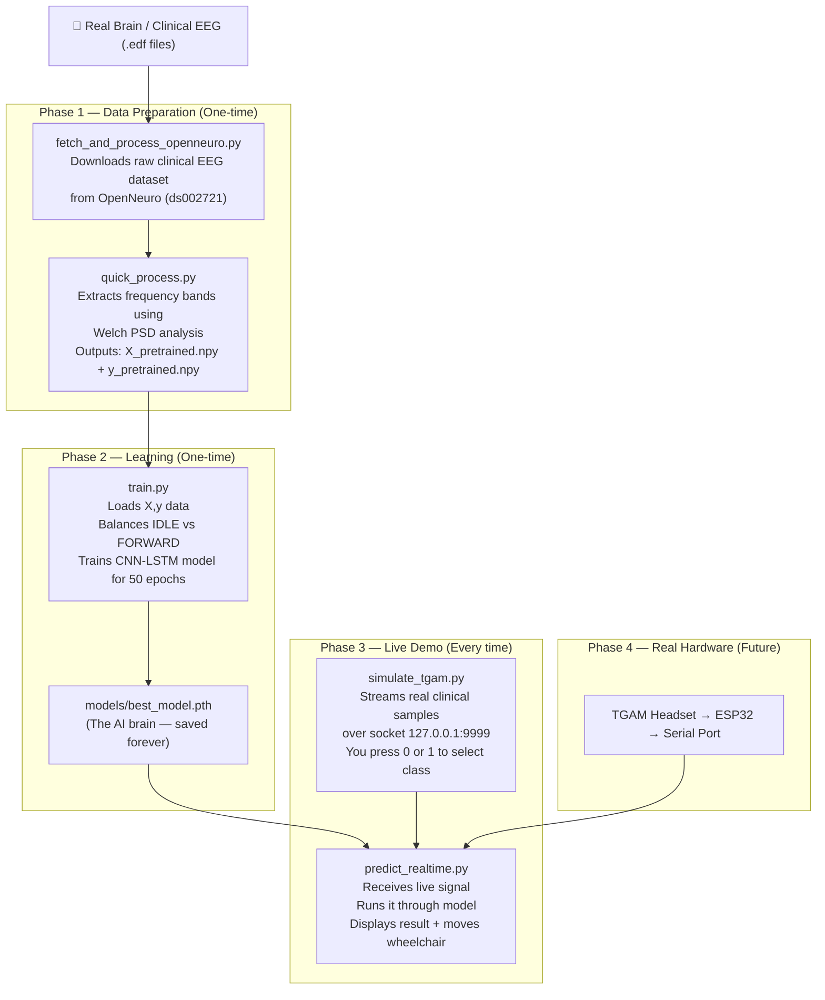

# ORBIT AI — Full System Architecture & File Guide

## 🧠 What is ORBIT AI?
ORBIT AI is a **Brain-Computer Interface (BCI)** system. It reads electrical signals from your brain, classifies your mental state using a Deep Learning model, and translates that into wheelchair movement commands — all in real time.

---

## 🗺️ Complete Workflow Diagram



---

## 📁 File-by-File Deep Dive

### 1. `config.py` — The Control Panel
**Purpose:** Central settings file. All other files import from here.

```
SERIAL_PORT     → Which USB port the TGAM headset is on (COM3)
BAUD_RATE       → Speed of serial communication (57600)
TRAIN_WINDOW_SIZE → How many EEG packets form one "thought" (10 = 1 second)
MODEL_PATH      → Where the trained AI brain is saved
DATA_DIR        → Where training data lives
COMMANDS        → Maps numbers to actions {0: IDLE, 1: FORWARD, 2: LEFT...}
```

**Analogy:** Like a settings panel on a phone — change one value here and it updates everywhere.

---

### 2. `fetch_and_process_openneuro.py` — The Data Downloader
**Purpose:** Downloads real clinical EEG research data from the internet.

**How it works:**
1. Connects to [OpenNeuro.org](https://openneuro.org) (a public brain data library)
2. Downloads dataset `ds002721` — a motor imagery EEG study with 23 subjects
3. Reads the raw `.edf` files (medical EEG format)
4. Maps the clinical task types to ORBIT AI classes:
   - `run1` → **IDLE** (subject was resting)
   - `run2/run3` → **FORWARD** (subject imagined movement)

**Output:** Raw `.edf` files stored in `data/external/ds002721/`

---

### 3. `quick_process.py` — The Feature Engineer (The Most Important Script)
**Purpose:** Converts raw brainwave data into numbers the AI can understand.

**The Science — Welch Power Spectral Density (PSD):**

Your brain produces electrical waves at different frequencies. Each frequency tells us something different:

| Band | Frequency | Meaning |
|------|-----------|---------|
| Delta (δ) | 0.5–4 Hz | Deep sleep |
| Theta (θ) | 4–8 Hz | Drowsiness, meditation |
| Alpha (α) | 8–13 Hz | Relaxed, eyes closed ← **IDLE** |
| Beta (β) | 13–30 Hz | Active thinking, focus ← **FORWARD** |
| Gamma (γ) | 30–50 Hz | High concentration |

**How it works step by step:**
1. Loads each `.edf` file using MNE library
2. Applies a **bandpass filter** (1–50Hz) to remove noise and muscle artefacts
3. Cuts the data into **1-second chunks**
4. For each chunk, uses **Welch's method** to calculate power in each frequency band
5. Averages across ALL EEG channels (multi-channel = more accurate)
6. Calculates derived features: `attention = beta/alpha`, `meditation = alpha/theta`
7. Applies **Z-score normalization** (centres data around 0)
8. Saves into sliding windows of 10 rows each

**Output:**
- `data/X_pretrained.npy` → Shape: `(30754, 10, 11)` = 30k samples × 10 time steps × 11 features
- `data/y_pretrained.npy` → Shape: `(30754,)` = label for each sample (0=IDLE, 1=FORWARD)

---

### 4. `model.py` — The AI Brain Architecture
**Purpose:** Defines the structure of the neural network.

**Architecture: CNN-LSTM Hybrid with Self-Attention**

```
Input: [batch, 10 timesteps, 18 features]
         ↓
CNN Block 1: Conv1D (18→64 channels) + BatchNorm + ReLU
         ↓
MaxPool1D: Reduces time dimension (10 → 5)
         ↓
CNN Block 2: Conv1D (64→128 channels) + BatchNorm + ReLU
         ↓
LSTM (2 layers, bidirectional): Learns temporal patterns
         ↓
Global Average Pooling: Collapses time dimension
         ↓
BatchNorm + Dropout (regularisation)
         ↓
Fully Connected (128 → 64 → n_classes)
         ↓
Output: Softmax probabilities [IDLE%, FORWARD%]
```

**Why CNN + LSTM?**
- **CNN** is good at finding local patterns (e.g., a sudden spike in Beta power)
- **LSTM** is good at finding patterns across time (e.g., Beta staying high for 1 second = "Focus")
- Together they recognize both the "shape" and the "duration" of a mental state

---

### 5. `train.py` — The Teacher
**Purpose:** Uses the processed data to teach the AI model.

**How it works:**
1. Loads `X_pretrained.npy` and `y_pretrained.npy`
2. **Balances the dataset** — undersamples FORWARD so IDLE and FORWARD are equal (avoids bias)
3. Splits into **80% training / 20% validation**
4. Creates the CNN-LSTM model (`n_classes=2` for binary IDLE/FORWARD)
5. Trains for **50 epochs** using:
   - **AdamW optimizer** — modern, fast gradient descent
   - **Cosine Annealing** — learning rate starts at 0.001, smoothly reduces to 0.00001
   - **Class-weighted CrossEntropy** — penalises wrong predictions on the minority class more
   - **Gradient clipping** — prevents exploding gradients
6. Saves the **best model** (by validation accuracy) to `models/best_model.pth`

**Output:** `models/best_model.pth` — the trained AI weights

---

### 6. `simulate_tgam.py` — The Fake Headset
**Purpose:** Replaces the physical TGAM headset for demo purposes.

**How it works:**
1. Loads the real clinical data (`X_pretrained.npy`)
2. Opens a **TCP server** on `127.0.0.1:9999`
3. Listens for keyboard input (`0` = IDLE, `1` = FORWARD)
4. Picks real EEG samples matching the chosen class
5. Sends them as JSON packets at **10Hz** (10 per second) to the dashboard
6. Only switches class when YOU press a key — no auto-changes

**Why is this clever?** Instead of making up fake numbers, it streams **real human brainwave patterns** from the clinical dataset. So the AI receives genuine EEG signatures, making the demo scientifically valid.

---

### 7. `predict_realtime.py` — The Live Dashboard
**Purpose:** The real-time inference engine and visual display.

**How it works:**
1. Loads the trained `best_model.pth`
2. Connects to the simulator (or real headset) via socket
3. **Flushes stale data** — always reads the newest packet only (eliminates lag)
4. Builds a **sliding window** of 10 packets (1 second of brain data)
5. Once the window is full, runs it through the CNN-LSTM model
6. Gets probabilities: e.g., `[IDLE: 12%, FORWARD: 88%]`
7. Takes the highest — sends that as the command
8. Updates the **Virtual Arena** — moves the `W` (wheelchair) accordingly
9. Wheelchair **wraps around** when it hits the top wall

**Display:**
```
╭─ System Diagnostics ─╮╭────── Virtual Arena ──────╮
│ STATUS:   FORWARD    ││ +──────────────────────+   │
│ CONFIDENCE: 88.2%    ││ │         W            │   │
│ DEVICE: Clinical EEG ││ │                      │   │
╰──────────────────────╯╰──────────────────────────╯
```

---

### 8. Supporting Files

| File | Purpose |
|------|---------|
| `collect_data.py` | Collects YOUR personal brain data (for fine-tuning) |
| `fine_tune.py` | Adapts the pre-trained model to YOUR personal brain |
| `evaluate.py` | Measures accuracy, confusion matrix, F1 score |
| `preprocess.py` | Older preprocessing pipeline (augmentation, outlier removal) |
| `requirements.txt` | Python libraries needed (`torch`, `mne`, `rich`, `scipy`, etc.) |
| `.gitignore` | Prevents large data files being pushed to GitHub |

---

## 🔄 The Two Modes

### Demo Mode (Now)
```
simulate_tgam.py  →(socket)→  predict_realtime.py --demo
    ↑
 (You control with keyboard: 0/1)
```

### Real Hardware Mode (Future)
```
Your Brain → TGAM Headset → ESP32 → USB Serial → predict_realtime.py
```
Just change `SERIAL_PORT` in `config.py` and remove `--demo`.

---

## 🏆 Summary: The 3 Phases

| Phase | Scripts | Runs | Output |
|-------|---------|------|--------|
| **Prepare** | `fetch_and_process_openneuro.py` → `quick_process.py` | Once | `X,y.npy` files |
| **Learn** | `train.py` | Once (or after new data) | `best_model.pth` |
| **Demo** | `simulate_tgam.py` + `predict_realtime.py` | Every demo | Live wheelchair control |
