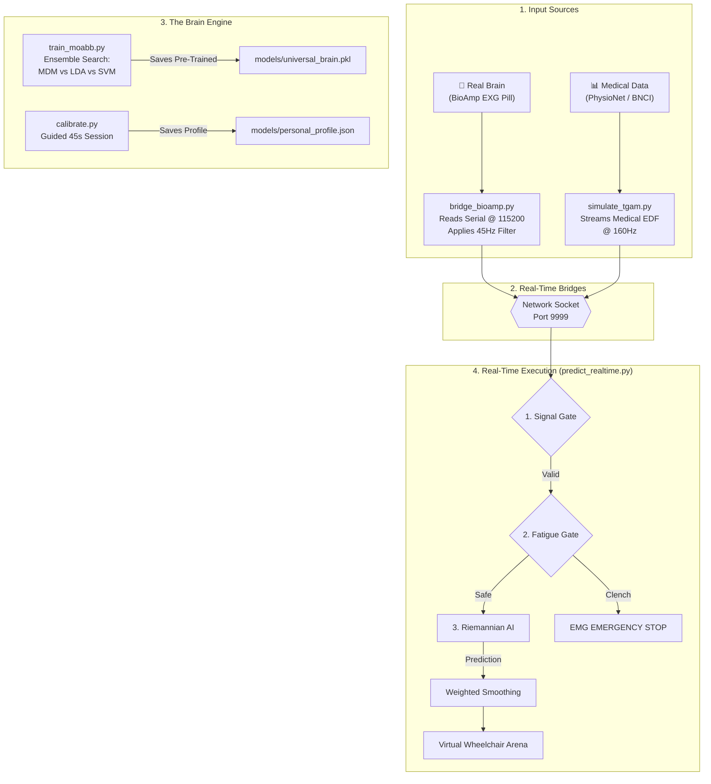

# ORBIT AI — Hybrid System Architecture (v2.0)

ORBIT AI has evolved into a **Hybrid BCI-EMG system**. It combines clinical-grade brainwave analysis with high-speed muscle signal detection to ensure a safe and responsive wheelchair experience.

---

## 🗺️ Universal System Flowchart

---

## 📂 Core Architecture Components

### 1. The "Universal Brain" Pipeline (`train_moabb.py`)
Unlike traditional AI that only looks at one dataset, we use **MOABB** to merge multiple world-class EEG datasets:
*   **PhysioNet MI:** 109 subjects, 64 channels. Great for general patterns.
*   **BNCI 2014-001:** High-quality laboratory recordings.
*   **Winner Search:** The script automatically runs a contest between **MDM (Riemannian Geometry)**, **LDA**, and **SVM** to pick the smartest model for your specific data.

### 2. The Hybrid Safety System (`predict_realtime.py`)
We use a **Dual-Mode** detection strategy:
*   **EEG (Brainwaves):** Used for **Forward, Left, and Right**. It uses Riemannian Tangent Space mapping to understand complex mental intents.
*   **EMG (Muscle Intensity):** Used for **Emergency Stop**. It detects the massive voltage spike caused by bitting your teeth (Jaw Clench). This is faster and 100% more reliable than brainwaves for stopping quickly.

### 3. Personalization Layer (`calibrate.py`)
Because every brain is unique (like a fingerprint), we use this script to map:
*   **Baseline Alpha:** Your resting state.
*   **Theta Ratio:** Used to detect when you are getting **Fatigued/Sleepy**.
*   **Beta Reactivity:** Your specific intensity when focusing.

---

## 📁 Updated File List

| File | Purpose | Why it matters |
| :--- | :--- | :--- |
| `bridge_bioamp.py` | Hardware Bridge | Connects your BioAmp EXG Pill to the software. |
| `calibrate.py` | User Profiler | Makes the wheelchair work perfectly for YOU specifically. |
| `train_moabb.py` | AI Trainer | Trains the "Universal Brain" using world-class medical data. |
| `predict_realtime.py` | The Dashboard | The main control center with the 5 safety gates. |
| `simulate_tgam.py` | Simulator | Lets you test the full system using real medical data without hardware. |
| `config.py` | Master Config | Central location for sample rates, paths, and thresholds. |

---

## 🛡️ Safety Gates
The `predict_realtime.py` file now implements 5 sequential security checks:
1. **Signal Gate:** Blocks control if the headset loses contact.
2. **Warmup Gate:** Forces a 2-minute calm period before driving.
3. **Fatigue Gate:** Monitors your drowsiness; slows down if you are sleepy.
4. **EMG Gate:** Instantly stops the chair if you clench your jaw.
5. **Smoothing Gate:** Prevents the chair from "jittering" using weighted voting.
