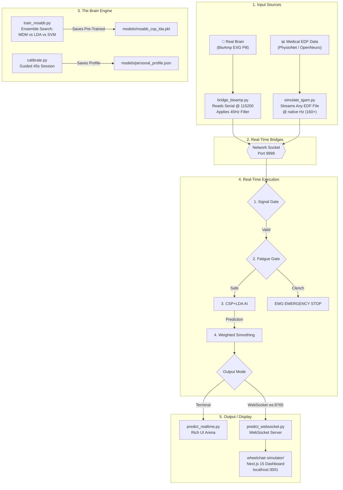

# ORBIT AI — Hybrid System Architecture (v3.0)

ORBIT AI is a **Hybrid BCI wheelchair simulation system** combining clinical-grade brainwave analysis with a premium web-based virtual dashboard. It uses real EEG motor imagery data, MOABB CSP+LDA AI inference, and a Next.js 15 real-time web simulator — inspired by the TGAM NeuroSky Mindwave wheelchair project.

---

## 🗺️ Universal System Flowchart



---

## 📂 Core Architecture Components

### 1. The "Universal Brain" Pipeline (`train_moabb.py`)
Unlike traditional AI that only looks at one dataset, we use **MOABB** to merge multiple world-class EEG datasets:
- **PhysioNet MI:** 109 subjects, 64 channels. General motor imagery patterns.
- **BNCI 2014-001:** High-quality laboratory recordings.
- **Winner Search:** The script automatically runs a contest between **MDM (Riemannian Geometry)**, **LDA**, and **SVM** to pick the best model.

### 2. The Hybrid Safety System (`predict_realtime.py` / `predict_websocket.py`)
We use a **5-Gate** detection strategy in sequence:

| Gate | Check | Action on Failure |
| :--- | :--- | :--- |
| 1. Signal Gate | Electrode contact & noise | Force IDLE |
| 2. Warmup Gate | 5-second session warmup | Hold CALIBRATING |
| 3. Fatigue Gate | Theta/(Alpha+Beta) ratio | STAY_IDLE (FATIGUED) |
| 4. EMG Gate | Jaw clench spike detection | EMERGENCY STOP |
| 5. Smoothing Gate | 3-frame weighted voting | Prevents jitter |

### 3. Personalization Layer (`calibrate.py`)
Because every brain is unique (like a fingerprint), this script maps:
- **Baseline Alpha:** Your resting state.
- **Theta Ratio Threshold:** Used to detect fatigue/drowsiness.
- **Beta Reactivity:** Your specific intensity when focusing.
- **MOABB Confidence Threshold:** Your personal classification confidence cutoff.

### 4. Dual Output Architecture
ORBIT AI now has two output modes for the same inference pipeline:

| Mode | Script | Output | Best For |
| :--- | :--- | :--- | :--- |
| Terminal | `predict_realtime.py` | Rich TUI arena | Quick testing, no browser |
| Web | `predict_websocket.py` + `wheelchair-simulator/` | Next.js dashboard at `localhost:3001` | Demo, visualization, sharing |

---

## 🌐 Web Simulator Architecture (`wheelchair-simulator/`)

The web simulator is a **Next.js 15 (App Router + Turbopack)** application built with:

```
wheelchair-simulator/
├── src/
│   ├── app/
│   │   ├── layout.tsx        ← Root layout, next/font/google, SEO metadata
│   │   ├── globals.css       ← Design system: CSS variables, dark-first, glassmorphism
│   │   └── page.tsx          ← Dashboard page: WebSocket client, state, layout
│   ├── components/
│   │   ├── Arena.tsx         ← Animated SVG wheelchair + grid + glow effects
│   │   ├── StatusPanel.tsx   ← Live command, confidence, fatigue, session stats
│   │   └── BrainPowerPanel.tsx ← Theta/Alpha/Beta animated power bars
│   └── lib/
│       ├── animations.ts     ← Framer Motion constants (SPRING_SMOOTH, EASE_OUT_EXPO etc.)
│       └── utils.ts          ← cn() helper (clsx + tailwind-merge)
├── package.json
├── next.config.ts
└── tsconfig.json
```

**Tech Stack:**
- **Framework:** Next.js 15 (App Router), TypeScript strict mode
- **Styling:** Tailwind CSS + CSS variables (dark-first design, `#050A18` base)
- **Animation:** Framer Motion (spring physics, viewport-triggered reveals)
- **Fonts:** Syne (display, 800w headlines) + DM Sans (body, 300–500w) via `next/font/google`
- **Icons:** Lucide React
- **Utilities:** clsx, tailwind-merge, class-variance-authority

**Design System:**
- **Base Color:** `#050A18` (deep navy dark)
- **Accent:** `#38BDF8` (sky blue) + `#FB923C` (warm orange highlight)
- **Glass Cards:** `bg-white/[0.03] border-white/[0.08] backdrop-blur-xl` with inset top-edge light catch
- **Command Colors:** `#4ADE80` (FORWARD), `#F87171` (CRITICAL), `#FBBF24` (WARNING)

---

## 🚀 Running the Full Stack

### Step 1: Stream EEG Data (Simulator)
```powershell
.\.venv\Scripts\python.exe simulate_tgam.py
# Paste a PhysioNet URL e.g.:
# https://physionet.org/files/eegmmidb/1.0.0/S001/S001R04.edf
```

### Step 2: Start AI + WebSocket Server
```powershell
.\.venv\Scripts\python.exe predict_websocket.py
```

### Step 3: Launch Web Dashboard
```powershell
cd wheelchair-simulator
npm run dev
# Open: http://localhost:3001
```

---

## 📁 Complete File Reference

| File | Category | Purpose |
| :--- | :--- | :--- |
| `simulate_tgam.py` | Bridge | Streams any EDF file over socket:9999 |
| `bridge_bioamp.py` | Bridge | Live BioAmp EXG Pill serial bridge |
| `bridge_ad8232.py` | Bridge | Live AD8232 + Arduino serial bridge |
| `fetch_and_process_openneuro.py` | Data | Downloads OpenNeuro datasets |
| `preprocess.py` | Data | Offline data cleaning, windowing, scaling |
| `quick_process.py` | Data | Fast PSD-based preprocessing |
| `model.py` | AI | PyTorch CNN-LSTM + BiLSTM architectures |
| `train.py` | AI | Deep learning trainer (CNN-LSTM) |
| `train_moabb.py` | AI | MOABB CSP+LDA / MDM / SVM trainer |
| `fine_tune.py` | AI | Transfer learning fine-tuner |
| `calibrate.py` | AI | Personal brain profiler |
| `collect_data.py` | AI | Personal data collector |
| `predict_realtime.py` | Runtime | Terminal BCI dashboard (Rich TUI) |
| `predict_websocket.py` | Runtime | WebSocket BCI server for web dashboard |
| `wheelchair-simulator/` | Frontend | Next.js 15 virtual wheelchair web app |
| `evaluate.py` | Diagnostics | Model evaluation + confusion matrix |
| `diagnose.py` | Diagnostics | Offline pipeline validator |
| `logger_orbit.py` | Logging | Centralized real-time CSV logger |
| `session_logger.py` | Logging | High-frequency telemetry recorder |
| `auto_report.py` | Reporting | PDF/text session report generator |
| `config.py` | Config | Master configuration panel |
| `requirements.txt` | Config | Python dependency list |

---

## 🛡️ Safety Gates
The `predict_realtime.py` and `predict_websocket.py` files both implement 5 sequential safety checks:
1. **Signal Gate:** Blocks control if the headset loses contact or is too noisy.
2. **Warmup Gate:** Forces a 5-second calm period before any inference begins.
3. **Fatigue Gate:** Monitors Theta/(Alpha+Beta) ratio; stops on drowsiness.
4. **EMG Gate:** Instantly stops on jaw clench voltage spike.
5. **Smoothing Gate:** Prevents jitter using 3-frame weighted voting (0.2 / 0.3 / 0.5).
