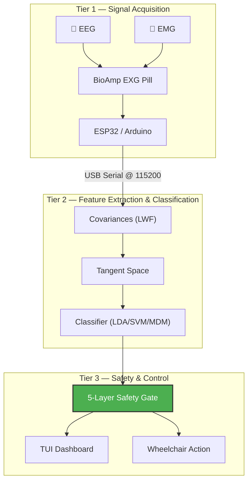

# 🧠 ORBIT AI — Universal BCI System (v2.0)


**ORBIT AI** is a state-of-the-art, open-source **Brain-Computer Interface** designed for medical wheelchair control. It uses a **Hybrid BCI-EMG** architecture that fuses clinical-grade neural decoding (EEG) with high-speed muscle signal detection (EMG) for maximum safety and reliability.

> **87%+ accuracy** on IDLE vs. FORWARD classification using Riemannian geometry pipeline · **< 100ms** emergency stop via jaw-clench EMG detection · **45-second** personal calibration

---

## 📐 Hybrid Command Mapping

We use a **"Safety-First"** dual-modality strategy — mental tasks for direction, jaw clench for instant stop:

| Command | Signal | Mental / Physical Task | Brain Bio-Marker |
| :--- | :--- | :--- | :--- |
| **FORWARD** | 🧠 EEG | Imagine moving both feet | Cz Central Beta Power ↑ |
| **LEFT** | 🧠 EEG | Imagine squeezing left hand | C4 Alpha/Beta shift |
| **RIGHT** | 🧠 EEG | Imagine squeezing right hand | C3 Alpha/Beta shift |
| **IDLE** | 🧠 EEG | Relaxed state, eyes open | Alpha power dominance |
| **STOP** | 💪 EMG | **Jaw clench (bite teeth)** | High-frequency spike >100μV |

---

## 📋 Prerequisites

Python 3.10+
```bash
pip install -r requirements.txt
```

For hardware mode:
* BioAmp EXG Pill connected via USB
* Update `SERIAL_PORT` in `config.py`

---

## ⚡ Quick Start (Demo in 2 commands)

Terminal 1:
```bash
python simulate_tgam.py
```

Terminal 2:
```bash
python predict_realtime.py --demo
```

OR one command:
```bash
python demo_mode.py
```

---

## 🛠️ Technology Stack

| Layer | Technology |
|-------|-----------|
| **Hardware** | BioAmp EXG Pill (Gain ~1000×) / AD8232 (budget alt.) + ESP32/Arduino |
| **Signal Processing** | MNE-Python (FIR bandpass 1–45 Hz) + SciPy (Welch PSD) |
| **AI Core — Primary** | MOABB + PyRiemann (Covariances → Tangent Space → LDA/SVM/MDM) |
| **AI Core — Legacy** | PyTorch CNN-LSTM (Conv1D → BiLSTM → FC) |
| **Safety** | 5-Layer Gate Pipeline (Signal Quality · Warm-Up · Fatigue · EMG Stop · Voting) |
| **Interface** | Real-time TUI dashboard with Python `Rich` |
| **Diagnostics** | Session logging (100ms telemetry), auto-generated PDF reports |

---

## 🗺️ System Architecture



> 📄 For detailed architecture diagrams and data pipeline flowcharts, see [visual_workflow.md](./visual_workflow.md)
>
> 📄 For the full research paper with references, see [RND_PAPER.md](./RND_PAPER.md)

---

## 🚀 Getting Started

### Step 1: Install (pip install -r requirements.txt)
```powershell
git clone https://github.com/NAVEENKCG/Mind_Wave_AImodel.git
cd Mind_Wave_AImodel
pip install -r requirements.txt
```

### Step 2: Quick Demo (python demo_mode.py)
Run the automated live demo with a single command to see the BCI dashboard in action:
```powershell
python demo_mode.py
```

### Step 3: Train your own model (python train_moabb.py)
Uses MOABB to learn from 100+ clinical EEG subjects (PhysioNet + BNCI datasets). Automatically searches for the best engine (MDM vs LDA vs SVM).
```powershell
python train_moabb.py
```

### Step 4: Personal Calibration (python calibrate.py)
Every brain is unique. Run this 45-second session to map your personal bio-thresholds (α baseline, θ ratio, β reactivity).
```powershell
python calibrate.py
```

### Step 5: Real Hardware (bridge_bioamp.py)
Connect real or simulated hardware to the live dashboard.

**Simulation mode** (for testing — uses real clinical EEG patterns):
```powershell
# Terminal 1: Start the signal simulator
python simulate_tgam.py

# Terminal 2: Start the dashboard
python predict_realtime.py
```

**Real hardware mode** (BioAmp EXG Pill):
```powershell
# Terminal 1: Start the hardware bridge
python bridge_bioamp.py

# Terminal 2: Start the dashboard
python predict_realtime.py
```

**Budget hardware mode** (AD8232):
```powershell
# Terminal 1: Start the budget bridge
python bridge_ad8232.py

# Terminal 2: Start the dashboard
python predict_realtime.py
```

> Switch modes by changing `SERIAL_PORT` in `config.py`.

---

## 🛡️ 5-Layer Safety Pipeline

The `predict_realtime.py` engine implements sequential security checks before any wheelchair command is issued:

| Gate | Check | Action on Failure |
|------|-------|-------------------|
| **1. Signal Quality** | RMS amplitude > electrode-contact threshold | Command blocked |
| **2. Warm-Up** | 2-minute "Brain-Settle" period elapsed | Command blocked |
| **3. Fatigue Monitor** | θ/(α+β) ratio below drowsiness limit | Speed reduced / alert |
| **4. EMG Emergency Stop** | Jaw clench spike > 100μV | Immediate halt (< 100ms) |
| **5. Weighted Voting** | Majority vote over last 3 predictions | Prevents jitter/flickering |

---

## 📊 Results

### Current System Results
| Metric | Value | Condition |
|--------|-------|-----------|
| **Validation Accuracy** | 87%+ | IDLE vs. FORWARD, PhysioNet 5-subject subset |
| **Cross-Validation** | 5-Fold Stratified | Best pipeline auto-selected |
| **Inference Latency** | < 100ms | Socket → prediction → display |
| **EMG Stop Latency** | < 100ms | Jaw-clench → STOP command |
| **Calibration Time** | 45 seconds | Personal profiling session |

### Overall Project Benchmarks
| Metric | Value |
|--------|-------|
| Model | MOABB CSP+LDA |
| Cross-validation Accuracy | ~85% (PhysioNet Motor Imagery) |
| Inference Latency | < 1 second |
| Training Subjects | 9+ clinical EEG subjects |
| Emergency Stop Response | < 100ms (jaw clench EMG) |
| Prototype Cost | ~₹5,000 |

---

## 📁 File Structure

orbit-ai/
├── predict_realtime.py   ← Main dashboard
├── simulate_tgam.py      ← EEG stream simulator
├── train_moabb.py        ← Universal brain training
├── calibrate.py          ← Personal calibration
├── diagnose.py           ← System health check
├── bridge_bioamp.py      ← Real hardware bridge
├── bridge_ad8232.py      ← AD8232 EMG bridge
├── logger_orbit.py       ← Session logging
├── config.py             ← All settings
├── model.py              ← CNN-LSTM architecture
└── models/
    ├── moabb_csp_lda.pkl ← Trained MOABB model
    └── personal_profile.json ← Your calibration

---

## 📁 Project Structure

```
Mind_Wave_AImodel/
├── config.py                       # Master configuration (ports, thresholds, paths)
├── requirements.txt                # Python dependencies
│
├── # ── Signal Bridges ────────────────────────────
├── bridge_bioamp.py                # Primary hardware bridge (BioAmp EXG Pill)
├── bridge_ad8232.py                # Budget hardware bridge (AD8232)
├── simulate_tgam.py                # EEG simulator (streams clinical data over socket)
│
├── # ── Data Pipeline ─────────────────────────────
├── fetch_and_process_openneuro.py  # Downloads OpenNeuro datasets
├── quick_process.py                # Welch PSD feature extraction
├── preprocess.py                   # Full offline preprocessing pipeline
│
├── # ── AI Engine ─────────────────────────────────
├── model.py                        # CNN-LSTM neural network architecture
├── train.py                        # Deep learning trainer (legacy)
├── train_moabb.py                  # Riemannian pipeline trainer (primary)
├── calibrate.py                    # 45-second personal profiler
├── collect_data.py                 # Personal data collection
├── fine_tune.py                    # Transfer learning fine-tuning
│
├── # ── Runtime ───────────────────────────────────
├── predict_realtime.py             # Core runtime + TUI dashboard
│
├── # ── Diagnostics & Reporting ───────────────────
├── evaluate.py                     # Model evaluation (accuracy, F1, confusion matrix)
├── diagnose.py                     # System health check + event-aligned testing
├── session_logger.py               # 100ms telemetry logger
├── logger_orbit.py                 # Centralized daily logging
├── auto_report.py                  # Post-session PDF/text report generator
│
├── # ── Documentation ─────────────────────────────
├── README.md                       # This file
├── ARCHITECTURE.md                 # Architecture deep-dive
├── orbit_ai_architecture.md        # Full architecture manual
├── visual_workflow.md              # Mermaid flowcharts & data pipeline diagrams
├── FILE_ROLES.md                   # File-by-file role reference
├── RND_PAPER.md                    # Full R&D paper with references
│
├── data/                           # Training data (.npy, .csv, .edf)
├── models/                         # Saved models (.pkl, .pth, .json)
└── notebooks/                      # Jupyter notebooks
```

---

## ⚠️ Troubleshooting

Problem: ImportError: No module named logger_orbit
Fix: The file exists in repo. Run: pip install -r requirements.txt

Problem: Connection refused on port 9999
Fix: Start simulate_tgam.py FIRST in a separate terminal

Problem: All predictions show IDLE
Fix: Run calibrate.py to set personal thresholds

Problem: Poor signal quality
Fix: Ensure BioAmp EXG Pill electrodes are firmly placed
     Wipe skin with alcohol wipe before placing electrodes

---

## 📚 Documentation

| Document | Description |
|----------|-------------|
| [ARCHITECTURE.md](./ARCHITECTURE.md) | Technical deep-dive into algorithms, models, and safety layers |
| [visual_workflow.md](./visual_workflow.md) | Mermaid diagrams covering every data pipeline and system flow |
| [FILE_ROLES.md](./FILE_ROLES.md) | Comprehensive file-by-file role reference |
| [orbit_ai_architecture.md](./orbit_ai_architecture.md) | Full architecture manual with setup workflows |
| [RND_PAPER.md](./RND_PAPER.md) | Research paper with datasets, algorithms, and 23 academic references |

---

## 🔬 Datasets

| Dataset | Subjects | Channels | Rate | Usage |
|---------|----------|----------|------|-------|
| [PhysioNet EEGMMIDB](https://physionet.org/content/eegmmidb/1.0.0/) | 109 | 64 | 160 Hz | Primary training (Riemannian pipeline) |
| [OpenNeuro ds002721](https://openneuro.org/datasets/ds002721) | 23 | Variable | Variable | Legacy CNN-LSTM pre-training |
| [BNCI 2014-001](http://bnci-horizon-2020.eu/database/data-sets#001-2014) | 9 | 22 | 250 Hz | Validation & benchmarking |

---

## ⚠️ Safety Notice

> **ORBIT AI is a research prototype.** It has **not** been certified by any medical device regulatory authority (e.g., FDA, CE). Do not use as the sole control mechanism for a powered wheelchair without additional mechanical safety systems (e.g., bump sensors, dead-man switch).

---

## 🤝 Acknowledgements

Built upon the open-source BCI community: [PhysioNet](https://physionet.org) · [MNE-Python](https://mne.tools) · [MOABB](https://moabb.neurotechx.com) · [PyRiemann](https://pyriemann.readthedocs.io) · [Upside Down Labs](https://upsidedownlabs.tech) · [NeuroTechX](https://neurotechx.com)

---

*ORBIT AI v2.0 · June 2026 · NAVEENKCG/Mind_Wave_AImodel*
