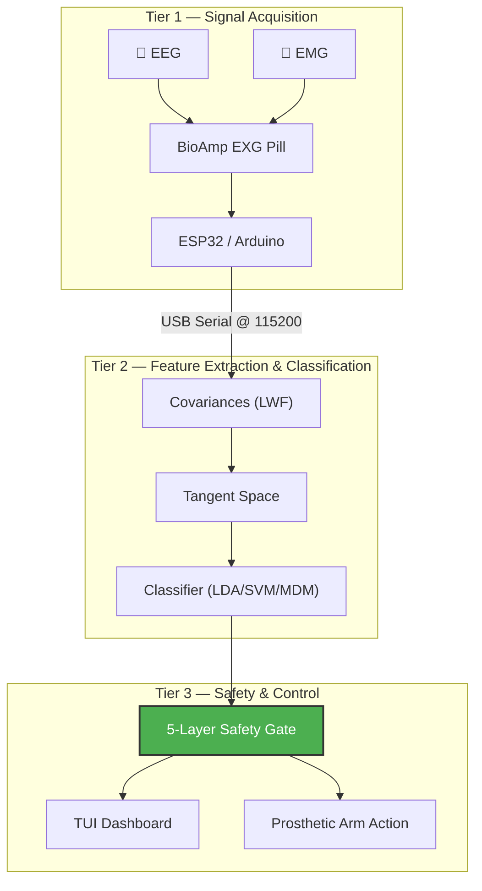

# 🧠 ORBIT AI — Universal BCI System (v3.0)


**ORBIT AI** is an open-source **Brain-Computer Interface** designed for medical prosthetic arm control. It uses a **Hybrid BCI-EMG** architecture — EEG-based neural decoding for movement commands, and EMG-based jaw-clench detection for instant emergency stop.

> **83.71% accuracy** on IDLE vs. LIFT classification using Riemannian FBCSP+LDA · **< 100ms** emergency stop via jaw-clench EMG · **95-second** personal calibration

---

## 💡 Product Ideology

### The Problem We Refuse to Ignore

Approximately **5.4 million people** in the United States alone live with some form of paralysis. Worldwide, hundreds of millions of individuals with conditions like ALS, spinal cord injuries, cerebral palsy, and locked-in syndrome are denied the most basic human freedom — **the freedom to move**.

Traditional assistive technologies — joysticks, sip-and-puff controllers, eye-tracking systems — all demand some level of residual physical ability. For those with the most severe impairments, these solutions simply **do not exist**. The mind remains sharp, but the body cannot respond.

**ORBIT AI exists because thought should be enough.**

### Our Vision

> *A world where no conscious mind is trapped in a motionless body — where the mere intention to move is sufficient to move.*

### Our Mission

To build an **open-source, medically safe, and universally accessible** Brain-Computer Interface that translates raw neural signals into reliable prosthetic arm commands — and to make it available to **everyone**, not just those who can afford proprietary clinical systems costing $50,000+.

### Core Design Principles

| Principle | What It Means in Practice |
| :--- | :--- |
| 🛡️ **Safety Above All** | No prosthetic arm command is ever issued without passing a 5-layer security pipeline. A single jaw clench halts everything in under 100ms. The system would rather **do nothing** than do the wrong thing. |
| ♿ **Radical Accessibility** | The entire system costs under **₹5,000** (~$60) in hardware. The software is MIT-licensed and runs on consumer laptops. No hospital visit required. No proprietary lock-in. |
| 🧬 **Open Science, Open Code** | Every algorithm, every dataset reference, every training pipeline is public. We publish our research paper ([RND_PAPER.md](./RND_PAPER.md)) alongside our code — because breakthroughs locked behind paywalls don't save lives. |
| 🧠 **The Brain Adapts, So Must We** | No two brains are identical. ORBIT AI trains on a "Universal Brain" model from clinical datasets, then personalizes through a 95-second calibration. The system adapts to **you**, not the other way around. |
| 🤝 **Human Dignity First** | This is not a tech demo. Every design decision — from the fatigue monitor that slows the chair when you're tired, to the warm-up gate that waits until your brain signals stabilize — treats the user as a **person**, not a data source. |
| ⚡ **Hybrid Intelligence** | We don't rely on a single signal. EEG provides the intention. EMG provides the emergency brake. AI provides the pattern recognition. Redundancy is not overhead — it is **survival engineering**. |

---

## 📐 Hybrid Command Mapping

We use a **"Safety-First"** dual-modality strategy — mental tasks for direction, jaw clench for instant stop:

| Command | Signal | Mental / Physical Task | Brain Bio-Marker |
| :--- | :--- | :--- | :--- |
| **LIFT** | 🧠 EEG | Imagine moving both feet | Cz Central Beta Power ↑ |
| **LEFT** | 🧠 EEG | Imagine squeezing left hand | C4 Alpha/Beta shift |
| **RIGHT** | 🧠 EEG | Imagine squeezing right hand | C3 Alpha/Beta shift |
| **IDLE** | 🧠 EEG | Relaxed state, eyes open | Alpha power dominance |
| **STOP** | 💪 EMG | **Jaw clench (bite teeth)** | High-frequency spike >100μV |

> **Note:** The current system classifies **2 commands** (IDLE vs. LIFT). LEFT, RIGHT, and EMG-STOP are implemented in the hardware bridge (`bridge_bioamp.py`) but are not yet supported by the trained Riemannian model. See [Future Roadmap](#-future-roadmap) for the plan to expand to 4-class classification.

---

## 📋 Prerequisites

- Python 3.10+
- Node.js 18+ and npm (only required for the web dashboard)
- For real hardware mode: BioAmp EXG Pill connected via USB, 
  update `SERIAL_PORT` in `config.py`

---

## ⚡ Quick Start (Demo in 2 commands)

Terminal 1:
```bash
python simulate_tgam.py
```

Terminal 2:
```bash
python predict_realtime.py --demo
```

OR one command:
```bash
python demo_mode.py
```

---

## 🛠️ Technology Stack

| Layer | Technology |
|-------|-----------|
| **Hardware** | BioAmp EXG Pill (Gain ~1000×) / AD8232 (budget alt.) + ESP32/Arduino |
| **Signal Processing** | MNE-Python (FIR filtering 0.5–50 Hz) + SciPy (Welch PSD, Butterworth filters) |
| **AI Core — Active** | PyRiemann (Covariances → Tangent Space → LDA) with FBCSP 5-band feature extraction |
| **AI Core — Legacy** | PyTorch CNN-LSTM (Conv1D → BiLSTM → FC) — **not used in live inference** |
| **Safety** | 5-Layer Gate Pipeline (Signal Quality · Warm-Up · Fatigue · EMG Stop · Voting) |
| **Interface — Terminal** | Real-time TUI dashboard with Python `Rich` |
| **Interface — Web** | Next.js prosthetic arm simulator dashboard via WebSocket |
| **Diagnostics** | Session logging (100ms telemetry), auto-generated reports |

---

## 🗺️ System Architecture


```mermaid
flowchart TD
    subgraph T1["Tier 1 — Signal Acquisition"]
        EEG["🧠 EEG"] --> HW["BioAmp EXG Pill"]
        EMG["💪 EMG"] --> HW
        HW --> MCU["ESP32 / Arduino"]
    end

    subgraph T2["Tier 2 — Feature Extraction & Classification"]
        COV["Covariances (LWF)"] --> TS["Tangent Space"]
        TS --> CLS["Classifier (LDA/SVM/MDM)"]
    end

    subgraph T3["Tier 3 — Safety & Control"]
        GATE["5-Layer Safety Gate"]
        GATE --> TUI["TUI Dashboard"]
        GATE --> WC["Prosthetic Arm Action"]
    end

    MCU -->|"USB Serial @ 115200"| COV
    CLS --> GATE

    style GATE fill:#4caf50,stroke:#333,stroke-width:2px,color:#fff
```

> 📄 For the full research paper with references, see [RND_PAPER.md](./RND_PAPER.md)

---

## 🧬 What Algorithm Does ORBIT AI Currently Use?

### The Active Pipeline: Riemannian FBCSP + LDA

ORBIT AI's **live inference system** (`predict_realtime.py` and `predict_websocket.py`) uses a **Riemannian Geometry** pipeline — not a neural network. This is the gold standard for motor imagery BCI because it generalizes across different users without retraining.

**How it works — step by step:**

```
Raw EEG (21 motor-cortex channels × 160 samples = 1 second)
        │
        ▼
┌────────────────────────────────────────────┐
│  1. FILTER BANK (FBCSP)                    │
│     Splits signal into 5 frequency bands:  │
│     δ (0.5–4 Hz), θ (4–8), α (8–13),      │
│     β (13–30), γ (30–50)                   │
└──────────────────┬─────────────────────────┘
                   ▼
┌────────────────────────────────────────────┐
│  2. COVARIANCE MATRICES                    │
│     Computes how each channel relates to   │
│     every other (Ledoit-Wolf shrinkage)    │
│     → 21×21 matrix per band                │
└──────────────────┬─────────────────────────┘
                   ▼
┌────────────────────────────────────────────┐
│  3. RIEMANNIAN TANGENT SPACE               │
│     Projects curved manifold data onto     │
│     flat Euclidean space for classification │
└──────────────────┬─────────────────────────┘
                   ▼
┌────────────────────────────────────────────┐
│  4. LDA CLASSIFIER                         │
│     Draws a linear boundary to separate    │
│     IDLE from LIFT                      │
│     + Platt-calibrated probability output  │
└──────────────────┬─────────────────────────┘
                   ▼
             IDLE or LIFT
             (with confidence %)
```

**Why Riemannian over CNN-LSTM?**

| Factor | Riemannian (active) | CNN-LSTM (legacy) |
|--------|-------------------|-------------------|
| **Cross-user generalization** | ✅ Excellent — works on new users | ❌ Overfits to training subjects |
| **Calibration needed** | 95-second profile | Hours of personal data |
| **Validated accuracy** | **83.71%** (5-fold CV, leakage-free) | **Untested** (never formally evaluated) |
| **What it looks at** | Channel-to-channel relationships | Raw signal values over time |
| **Inference speed** | Very fast (matrix math) | Slower (neural network forward pass) |

**Key training details** (in `train_moabb.py`):
- **Dataset:** PhysioNet EEGMMIDB — 10 subjects, 21 motor-cortex channels (sensorimotor strip: FC5–FC6, C5–C6, CP5–CP6)
- **Motor imagery runs:** R04, R06, R08, R10, R12, R14 → LIFT class
- **Rest baseline runs:** R01, R02 → IDLE class
- **Architecture tournament:** MDM, TS+LDA, and FBCSP+LDA compete in 5-fold stratified CV — winner auto-selected
- **Augmentation:** Time-jitter (±25 samples), applied **inside** CV folds only (no data leakage)
- **Artifact rejection:** Epochs with >100µV peak-to-peak discarded (>25% bad channels)
- **Calibration:** Platt scaling on held-out 15% set for well-calibrated probabilities
- **Output:** Binary — IDLE (0) vs LIFT (1), saved as `models/moabb_csp_lda.pkl`

---

### Other Classification Engines in the Codebase

ORBIT AI has **three other classifiers** that serve different purposes. They are NOT alternatives that run alongside the Riemannian pipeline — each is used in a specific situation:

#### ERD-Based Classifier (Real Hardware — `bridge_bioamp.py`)

When using the physical BioAmp EXG Pill (which only has 2 channels: C3 and C4), the Riemannian model cannot run because it needs 21 channels. Instead, `bridge_bioamp.py` uses a pure signal-processing approach:

```
C3/C4 raw → Bandpass (1–45 Hz, stateful SOS filter)
  → Welch PSD (Mu+Beta: 8–30 Hz)
  → ERD% = (baseline − live) / baseline
  → 4-way threshold classifier (LIFT / LEFT / RIGHT / IDLE)
  → EMG fast-path: jaw clench detection on every sample (< 100ms)
```

- **No ML model** — pure signal processing with calibrated thresholds
- **LIFT inference:** Bilateral symmetry — C3 and C4 both desynchronize equally
- **LEFT/RIGHT:** Contralateral ERD (left hand imagery → C4 desynchronization, right hand → C3)

#### BioSensor Fallback (`predict_realtime.py` / `predict_websocket.py`)

If no trained MOABB model file (`moabb_csp_lda.pkl`) is found at startup, the dashboard falls back to a simple **Beta/Alpha log-ratio** threshold. This requires no training and provides ~60% accuracy.

#### CNN-LSTM (Legacy — `model.py` + `train.py`)

A deep learning model exists in the codebase but is **not loaded by any live inference script**. It was the original approach before the Riemannian pipeline was adopted.

```
Input (batch, 30, 18) → Conv1D(18→64) → BN → ReLU → MaxPool
  → Conv1D(64→128) → BN → ReLU
  → BiLSTM(128→64, 2 layers) → Global Avg Pool
  → FC(128→64) → FC(64→n_classes)
```

- **Status:** Code exists in `model.py`, trainer in `train.py`, saved weights in `models/best_model.pth` — but **none of the live prediction scripts load it**
- **Why inactive:** It requires subject-specific training data and does not generalize well to new users, which conflicts with the "Universal Brain" design goal
- **See:** [LEGACY.md](./LEGACY.md) for a full list of legacy files and their status

### ⚠️ Known Limitation: Channel Mismatch on Real Hardware

The Riemannian model is trained on 21-channel data, but the BioAmp bridge only provides 2 real channels (C3 and C4), zero-padding the remaining 19. This creates **degenerate covariance matrices** that violate the SPD manifold assumption. When using real hardware through `predict_realtime.py`, the Riemannian model's predictions are unreliable. The ERD classifier in `bridge_bioamp.py` handles this correctly. A future upgrade to **EEGNet** (a channel-agnostic CNN designed for BCI) is planned to unify both paths.

### Algorithm Selection Summary

| Engine | Status | Used When | Channels | Accuracy | File(s) |
|--------|--------|-----------|----------|----------|---------|
| **Riemannian FBCSP+LDA** | ✅ **Active** | Simulated data or ≥21ch hardware | 21 | 83.71% | `train_moabb.py` → `predict_realtime.py` / `predict_websocket.py` |
| **ERD Threshold** | ✅ **Active** | Real BioAmp hardware (2 channels) | 2 (C3, C4) | ~70% est. | `bridge_bioamp.py` |
| **BioSensor Fallback** | ⚠️ **Fallback** | No trained model file found | Any | ~60% est. | `predict_realtime.py` / `predict_websocket.py` |
| **CNN-LSTM** | ❌ **Inactive** | Not loaded by any live script | 18 features | Untested | `model.py` + `train.py` |

---

## 🚀 Getting Started

### 1. Installation

```bash
pip install -r requirements.txt
```

For the web dashboard, also install Node.js dependencies:
```bash
cd wheelchair-simulator
npm install
cd ..
```

### 2. The "Universal Brain" Training

```bash
python train_moabb.py
```

This downloads PhysioNet EEG data for 10 subjects, extracts motor imagery and rest epochs, runs an architecture tournament (MDM vs TS+LDA vs FBCSP+LDA), and saves the best model to `models/moabb_csp_lda.pkl`.

### 3. Personal Calibration

IMPORTANT: This requires `simulate_tgam.py` running in a 
separate terminal first, since `calibrate.py` connects to it 
via socket on port 9999.

Terminal 1:
```bash
python simulate_tgam.py
```

Terminal 2 (after Terminal 1 is running):
```bash
python calibrate.py
```

### 4. Real-time Control — Two Interface Options

Choose ONE of the following based on your needs:

#### Option A — Terminal Dashboard (fastest, for quick testing and debugging)

Terminal 1:
```bash
python simulate_tgam.py
```

Terminal 2:
```bash
python predict_realtime.py --demo
```

#### Option B — Full Web Dashboard (recommended for demos and presentations)

Terminal 1:
```bash
python simulate_tgam.py
```

Terminal 2:
```bash
python predict_websocket.py
```

Terminal 3:
```bash
cd wheelchair-simulator
npm run dev
```

Then open http://localhost:3000 in your browser to see the 
live prosthetic arm arena, brain power panel, and status dashboard.

#### For Real Hardware (instead of simulate_tgam.py)

Terminal 1:
```bash
python bridge_bioamp.py
```

Terminal 2:
```bash
python predict_realtime.py
# (or python predict_websocket.py for the web dashboard)
```

---

## 🛡️ 5-Layer Safety Pipeline

The `predict_realtime.py` and `predict_websocket.py` engines implement sequential security checks before any prosthetic arm command is issued:

| Gate | Check | Action on Failure |
|------|-------|-------------------|
| **1. Signal Quality** | RMS amplitude > electrode-contact threshold; artifact rejection (±100µV peak-to-peak) | Command blocked |
| **2. Warm-Up** | 5-second "Brain-Settle" period elapsed (0 in demo mode) | Command blocked |
| **3. Fatigue Monitor** | θ/(α+β) ratio below drowsiness limit (from personal profile) | Speed reduced / alert / CRITICAL halt |
| **4. EMG Emergency Stop** | Jaw clench spike > 100μV (via `bridge_bioamp.py`) | Immediate halt (< 100ms) |
| **5. Hysteresis Voting** | 3 consecutive LIFT predictions to engage; 1 IDLE to release (safety-biased) | Prevents jitter/flickering |

---

## 📊 Results

| Metric | Value | Condition |
|--------|-------|-----------|
| **Validation Accuracy** | 83.71% | IDLE vs. LIFT, 21-channel FBCSP+LDA (leakage-free CV + artifact rejection) |
| **Cross-Validation** | 5-Fold Stratified | Best pipeline auto-selected from MDM / TS+LDA / FBCSP+LDA |
| **Inference Latency** | < 100ms | Socket → prediction → display |
| **EMG Stop Latency** | < 100ms | Jaw-clench → STOP command |
| **Calibration Time** | 95 seconds | Personal profiling session |
| **Training Subjects** | 10 | PhysioNet EEGMMIDB clinical EEG subjects |
| **Prototype Cost** | ~₹5,000 (~$60) | BioAmp EXG Pill + ESP32/Arduino |

---

## 📁 Project Structure

```
Mind_Wave_AImodel/
├── config.py                       # Master configuration (ports, thresholds, paths, channel names)
├── requirements.txt                # Python dependencies
│
├── # ── Signal Bridges ────────────────────────────
├── bridge_bioamp.py                # Primary hardware bridge (BioAmp EXG Pill, 2-channel)
├── simulate_tgam.py                # EEG simulator (streams PhysioNet data over socket)
│
├── # ── AI Engine (Active) ────────────────────────
├── train_moabb.py                  # Riemannian FBCSP+LDA trainer (primary pipeline)
├── calibrate.py                    # 95-second personal profiler
│
├── # ── AI Engine (Legacy — Not Used at Runtime) ──
├── model.py                        # CNN-LSTM neural network architecture (inactive)
├── train.py                        # CNN-LSTM deep learning trainer (inactive)
├── preprocess.py                   # Feature engineering for CNN-LSTM (inactive)
├── collect_data.py                 # Personal data collection for CNN-LSTM (inactive)
├── fine_tune.py                    # Transfer learning for CNN-LSTM (inactive)
├── evaluate.py                     # Evaluates best_model.pth only (inactive)
├── fetch_and_process_openneuro.py  # OpenNeuro dataset downloader (inactive)
├── quick_process.py                # Welch PSD feature extraction (inactive)
│
├── # ── Runtime ───────────────────────────────────
├── predict_realtime.py             # Live TUI dashboard (loads moabb_csp_lda.pkl)
├── predict_websocket.py            # WebSocket server for web dashboard (loads moabb_csp_lda.pkl)
├── demo_mode.py                    # One-command demo launcher
│
├── # ── Diagnostics & Reporting ───────────────────
├── diagnose.py                     # System health check + event-aligned testing
├── logger_orbit.py                 # Centralized session logging (CSV with timestamps)
├── auto_report.py                  # Post-session report generator
├── adapt_drift.py                  # Adaptive Neural Drift Engine (Model 2) — adjusts thresholds over time
│
├── # ── Documentation ─────────────────────────────
├── README.md                       # This file
├── ARCHITECTURE.md                 # Architecture deep-dive
├── LEGACY.md                       # Legacy file reference (which files are inactive and why)
├── RND_PAPER.md                    # Full R&D paper with 23 academic references
├── CHANGELOG.md                    # Version history
│
├── # ── Web Dashboard ─────────────────────────────
├── wheelchair-simulator/           # Next.js virtual prosthetic arm dashboard
│   ├── src/app/page.tsx            # Main dashboard page
│   └── ...
│
├── data/                           # Training data (.npy, .csv, .edf, cached epochs)
├── models/                         # Saved models
│   ├── moabb_csp_lda.pkl           # ✅ Active Riemannian model (~43 MB)
│   ├── best_model.pth              # ❌ Legacy CNN-LSTM weights (not loaded at runtime)
│   └── personal_profile.json      # Personal calibration data (after running calibrate.py)
├── logs/                           # Session logs (CSV telemetry)
└── notebooks/                      # Jupyter notebooks
```

---

## 🔮 Future Roadmap

### What We're Doing Now (v3.0)
- ✅ Binary classification: **IDLE vs. LIFT** from motor imagery EEG
- ✅ Riemannian FBCSP+LDA pipeline trained on 10 PhysioNet subjects (83.71% CV accuracy)
- ✅ 5-layer safety gate pipeline with fatigue monitoring
- ✅ EMG emergency stop via jaw-clench detection (< 100ms)
- ✅ 95-second personal calibration
- ✅ Dual interface: Terminal TUI dashboard + Next.js web dashboard
- ✅ EEG stream simulator for development without hardware
- ✅ **Adaptive Neural Drift Engine (Model 2)** — detects brain signal degradation over time and auto-adjusts thresholds without modifying the original model

### 🧬 Adaptive Drift Engine (Model 2)

ORBIT AI now has a **two-model architecture** to handle signal changes from aging, medication, or neurodegeneration:

| Layer | File | What It Does | Modifies Original? |
|-------|------|-------------|-------------------|
| **Model 1** — Universal Brain | `moabb_csp_lda.pkl` | Core Riemannian classifier, trained once on PhysioNet | **NEVER modified** |
| **Model 2** — Drift Engine | `drift_profile.json` | Adjusts thresholds based on session log analysis | Only writes to its own file |

**How to use:**

```bash
# Analyze your session logs and generate adaptations
python adapt_drift.py

# View drift report without saving
python adapt_drift.py --report

# Reset to original behavior (delete drift profile)
python adapt_drift.py --reset
```

The drift engine reads your accumulated session logs from `logs/`, detects trends (declining confidence, signal amplitude changes, increased fatigue events), and writes threshold adjustments to `models/drift_profile.json`. Both `predict_realtime.py` and `predict_websocket.py` automatically load this file on startup. Deleting `drift_profile.json` instantly reverts to original Model 1 behavior.

### What's Coming Next
1. **4-Class Navigation** — Expand from IDLE/LIFT to LIFT/LEFT/RIGHT/STOP using multi-class Riemannian classifiers (the ERD classifier in `bridge_bioamp.py` already supports this at the signal level)
2. **EEGNet Integration** — Replace the channel-dependent Riemannian pipeline with a channel-agnostic compact CNN (EEGNet) to unify the 21-channel simulator path and the 2-channel hardware path into a single model
3. **Real-World Motor Integration** — Connect to physical prosthetic arm motors via CAN bus or ROS2
4. **Edge Deployment** — Port inference to Raspberry Pi / Jetson Nano for portable, offline use
5. **Online Domain Adaptation (Advanced)** — Continuous real-time model weight adaptation during use (the Drift Engine handles threshold-level adaptation offline; this would add live weight updates)
6. **Multi-Modal Fusion** — Combine EEG with eye-tracking and head gestures for richer command sets
7. **Clinical Trials** — Partner with rehabilitation centers for real-world validation with ALS and SCI patients
8. **Federated Learning** — Improve the universal model across users without centralizing raw EEG data

---

## ⚠️ Troubleshooting

**ImportError: No module named 'logger_orbit'**
Ensure `logger_orbit.py` exists in the project root. Run 
`git pull` to fetch the latest version if missing.

**Connection refused on port 9999**
Start `simulate_tgam.py` FIRST, in its own terminal, before 
running `calibrate.py`, `predict_realtime.py`, or `predict_websocket.py`.

**Web dashboard shows blank page / won't connect**
1. Confirm `predict_websocket.py` is running and shows 
   "WebSocket server started" in the terminal
2. Confirm you ran `npm install` inside `wheelchair-simulator/` 
   at least once
3. Check the browser console for WebSocket connection errors

**All predictions show IDLE**
Run `python calibrate.py` to set your personal bio-thresholds 
before running `predict_realtime.py` or `predict_websocket.py`.

**ModuleNotFoundError for moabb or pyriemann**
These are required by `train_moabb.py`. Run:
  `pip install moabb pyriemann`

---

## 🔬 Datasets

| Dataset | Subjects | Channels | Rate | Usage in ORBIT AI |
|---------|----------|----------|------|-------------------|
| [PhysioNet EEGMMIDB](https://physionet.org/content/eegmmidb/1.0.0/) | 109 (10 used) | 64 (21 selected) | 160 Hz | **Active** — Primary training for Riemannian pipeline |
| [OpenNeuro ds002721](https://openneuro.org/datasets/ds002721) | 23 | Variable | Variable | **Legacy** — Was used for CNN-LSTM pre-training |
| [BNCI 2014-001](http://bnci-horizon-2020.eu/database/data-sets#001-2014) | 9 | 22 | 250 Hz | **Reference** — Validation & benchmarking |

---

## 📚 Documentation

| Document | Description |
|----------|-------------|
| [ARCHITECTURE.md](./ARCHITECTURE.md) | Full system architecture and visual workflows |
| [RND_PAPER.md](./RND_PAPER.md) | Research paper with datasets, algorithms, and 23 academic references |
| [LEGACY.md](./LEGACY.md) | Legacy file reference — which files are inactive and why |
| [CHANGELOG.md](./CHANGELOG.md) | Version history and changes |

---

## ⚠️ Safety Notice

> **ORBIT AI is a research prototype.** It has **not** been certified by any medical device regulatory authority (e.g., FDA, CE). Do not use as the sole control mechanism for a powered prosthetic arm without additional mechanical safety systems (e.g., bump sensors, dead-man switch).

---

## 🤝 Acknowledgements

Built upon the open-source BCI community: [PhysioNet](https://physionet.org) · [MNE-Python](https://mne.tools) · [MOABB](https://moabb.neurotechx.com) · [PyRiemann](https://pyriemann.readthedocs.io) · [Upside Down Labs](https://upsidedownlabs.tech) · [NeuroTechX](https://neurotechx.com)

---

*ORBIT AI v3.0 · August 2026 · NAVEENKCG/Mind_Wave_AImodel*
