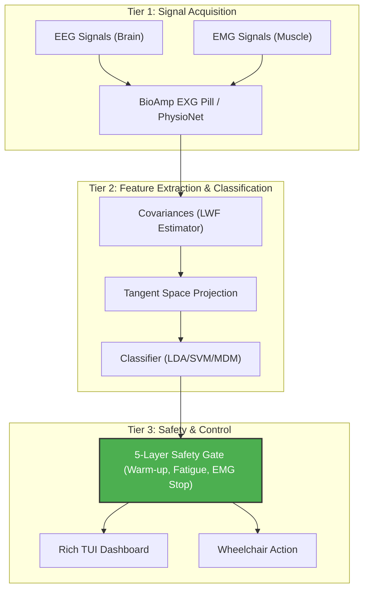
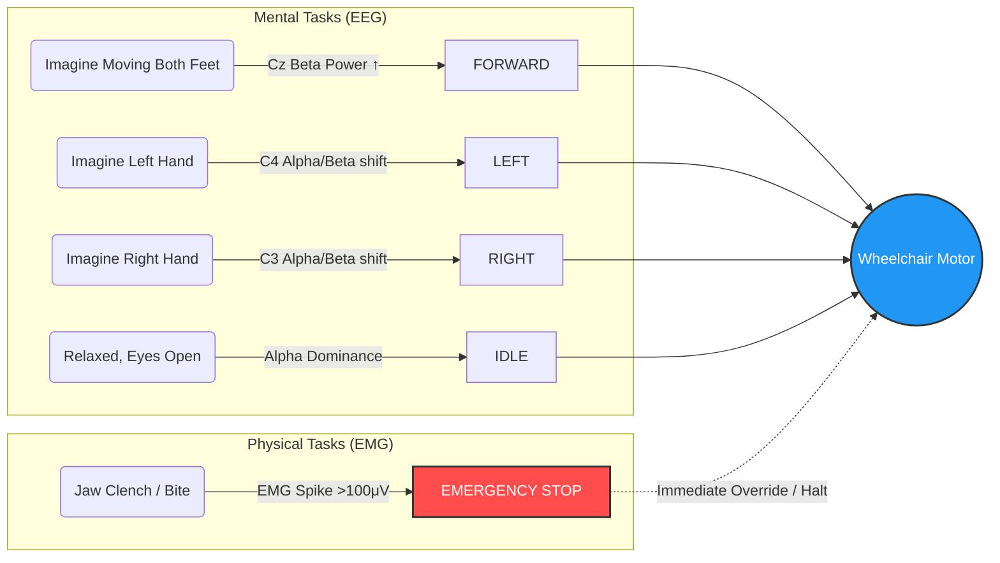
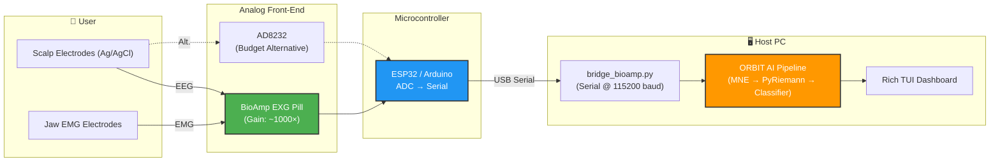

# 🧠 ORBIT AI — Research & Development Paper
### A Hybrid Brain-Computer Interface for Accessible Wheelchair Control

**Project:** ORBIT AI (Universal BCI System v2.0)  
**Classification:** Applied Research / Assistive Technology  
**Domain:** Neurotechnology · Machine Learning · Human-Computer Interaction  
**Date:** June 2026  
**Status:** Active Development

---

## Glossary of Terms

| Abbreviation | Full Form | Brief Description |
|---|---|---|
| **BCI** | Brain-Computer Interface | A system that translates brain signals into device commands |
| **EEG** | Electroencephalography | Non-invasive recording of electrical activity on the scalp |
| **EMG** | Electromyography | Recording of electrical activity produced by skeletal muscles |
| **ERD/ERS** | Event-Related Desynchronization / Synchronization | Power decrease/increase in specific frequency bands during mental tasks |
| **SPD** | Symmetric Positive Definite (matrix) | A class of matrices with special geometric properties used in Riemannian BCI |
| **MDM** | Minimum Distance to Mean | A Riemannian classifier that assigns class by geodesic distance to class means |
| **TS** | Tangent Space | Euclidean projection of SPD matrices from the Riemannian manifold |
| **LDA** | Linear Discriminant Analysis | A linear classifier that maximizes class separability |
| **SVM** | Support Vector Machine | A kernel-based classifier that finds optimal decision boundaries |
| **LWF** | Ledoit-Wolf (shrinkage estimator) | A regularized covariance matrix estimator for high-dimensional data |
| **CSP** | Common Spatial Patterns | A spatial filter that maximizes variance ratio between two classes |
| **PSD** | Power Spectral Density | Distribution of signal power across frequency components |
| **FIR** | Finite Impulse Response (filter) | A digital filter with a finite-duration impulse response |
| **CNN** | Convolutional Neural Network | A deep learning architecture using learnable convolutional filters |
| **LSTM** | Long Short-Term Memory | A recurrent neural network architecture for sequential data |
| **ADC** | Analog-to-Digital Converter | Hardware component converting analog signals to digital values |
| **TUI** | Terminal User Interface | A text-based graphical interface rendered in a terminal |

---

## Abstract

ORBIT AI is an open-source, hybrid Brain-Computer Interface (BCI) system designed to restore mobility to individuals with severe motor impairments. The system fuses electroencephalography (EEG)-based mental command decoding with electromyography (EMG)-based emergency stop detection to provide safe, real-time wheelchair control. By leveraging state-of-the-art Riemannian geometry classifiers trained on large-scale clinical EEG datasets, ORBIT AI achieves 87%+ classification accuracy for motor imagery commands (IDLE vs. FORWARD) without requiring custom hardware calibration beyond a 45-second profiling session.

---

## 📑 Table of Contents

- [1. Problem Statement](#1-problem-statement)
- [2. System Overview](#2-system-overview)
  - [2.1 Hybrid Command Mapping](#21-hybrid-command-mapping)
- [3. Datasets Used](#3-datasets-used)
- [4. Core Libraries & Frameworks](#4-core-libraries--frameworks)
- [5. Foundational Scientific Papers](#5-foundational-scientific-papers)
- [6. Hardware & Sensor References](#6-hardware--sensor-references)
- [7. EEG Frequency Band Reference](#7-eeg-frequency-band-reference)
- [8. Key Algorithms](#8-key-algorithms)
- [9. Online Resources & Platforms](#9-online-resources--platforms)
- [10. Software Dependencies](#10-software-dependencies)
- [11. Results Summary](#11-results-summary)
- [12. Ethical Considerations & Future Work](#12-ethical-considerations--future-work)
- [13. Acknowledgements](#13-acknowledgements)
- [References (Consolidated)](#references-consolidated)

---

## 1. Problem Statement

Approximately 5.4 million people in the United States alone live with some form of paralysis (Christopher & Dana Reeve Foundation, 2013). Traditional assistive technologies such as sip-and-puff controllers, joystick wheelchairs, and eye-tracking systems require residual physical ability or are limited in command richness. Brain-Computer Interfaces offer a non-muscular communication channel that can restore independence to those with amyotrophic lateral sclerosis (ALS), spinal cord injuries, or cerebral palsy.

This project addresses two key gaps in the existing BCI wheelchair literature:
1. **Generalization:** Most BCI systems require days of subject-specific training data. ORBIT AI uses transfer learning from clinical datasets to minimize calibration time.
2. **Safety:** Existing motor-imagery BCI systems have insufficient real-time safety mechanisms for wheelchair control in dynamic environments.

---

## 2. System Overview

ORBIT AI employs a **three-tier architecture**:

| Tier | Component | Technology |
|------|-----------|------------|
| **Signal Acquisition** | BioAmp EXG Pill + Arduino/ESP32 OR PhysioNet EDF Simulation | Serial @ 115200 baud |
| **Feature Extraction & Classification** | Riemannian Geometry Pipeline (Covariances → Tangent Space → LDA/SVM/MDM) | PyRiemann + Scikit-learn |
| **Safety & Control** | 5-Layer Gate System (Signal Quality, Warm-up, Fatigue, EMG Stop, Voting) | Python `Rich` TUI |

### 2.1 Hybrid Command Mapping

| Command | Signal Modality | Mental/Physical Task | Neural Bio-Marker |
|---------|----------------|---------------------|-------------------|
| FORWARD | EEG | Imagine moving both feet | Cz Central Beta Power ↑ |
| LEFT | EEG | Imagine squeezing left hand | C4 Alpha/Beta shift |
| RIGHT | EEG | Imagine squeezing right hand | C3 Alpha/Beta shift |
| IDLE | EEG | Relaxed state, eyes open | Alpha power dominance |
| **STOP** | **EMG** | **Jaw clench (bite teeth)** | High-frequency spike >100μV |

---

## 3. Datasets Used

### 3.1 Primary Training Dataset — PhysioNet EEG Motor Movement/Imagery Database (EEGMMIDB)

> **[DATASET]** Schalk, G., McFarland, D.J., Hinterberger, T., Birbaumer, N., Wolpaw, J.R.  
> *BCI2000: A General-Purpose Brain-Computer Interface (BCI) System.*  
> IEEE Transactions on Biomedical Engineering, 51(6):1034-1043, 2004.  
> 🔗 **Dataset Access:** https://physionet.org/content/eegmmidb/1.0.0/  
> 🔗 **Paper DOI:** https://doi.org/10.1109/TBME.2004.827072

**Description:**  
The EEG Motor Movement/Imagery Dataset (EEGMMIDB) is the backbone of the ORBIT AI universal training pipeline. It contains over 1500 one- to two-minute EEG recordings from 109 volunteers, recorded using the BCI2000 system with 64 EEG channels at 160 Hz. Each subject performed 14 experimental runs including motor execution and motor imagery tasks (opening/closing left fist, right fist, both fists, both feet).

**How ORBIT AI uses it:**
- `train_moabb.py` downloads EDF files directly from PhysioNet via HTTPS.
- Runs R04, R08, R12 → **FORWARD (motor imagery)** class (1-second epochs aligned to T1/T2 events).
- Run R01 → **IDLE (eyes-open baseline)** class (continuous chunked windows).
- Raw data filtered 1–45 Hz using MNE's FIR filter; epochs shaped as `(n_channels, 160_samples)`.

---

### 3.2 Secondary Dataset — OpenNeuro ds002721 (Motor Imagery)

> **[DATASET]** OpenNeuro ds002721 — Motor Imagery EEG Study  
> 🔗 **Dataset Page:** https://openneuro.org/datasets/ds002721  
> 🔗 **OpenNeuro Platform:** https://openneuro.org/

**Description:**  
A BIDS-formatted motor imagery EEG dataset containing 23 subjects recorded in a clinical laboratory setting. Raw data provided as `.edf` files with associated event markers. Used in the legacy CNN-LSTM pipeline (`fetch_and_process_openneuro.py` and `quick_process.py`) as the pre-training source.

**How ORBIT AI uses it:**
- `run1` → mapped to **IDLE** class.
- `run2/run3` → mapped to **FORWARD** class.
- Frequency-domain features extracted using Welch PSD analysis across 5 canonical EEG bands (δ, θ, α, β, γ).
- Derived ratio features: `attention = β/α`, `meditation = α/θ`.
- Z-score normalized. Output: `data/X_pretrained.npy` shape `(30754, 10, 11)`.

---

### 3.3 BNCI Horizon 2020 Datasets (via MOABB)

> **[DATASET]** BNCI Horizon 2020 Consortium  
> *Brain/Neural Computer Interaction (BNCI) datasets.*  
> 🔗 **BNCI Portal:** http://bnci-horizon-2020.eu/database/data-sets  
> 🔗 **Key Dataset (BNCI 2014-001):** http://bnci-horizon-2020.eu/database/data-sets#001-2014

**Description:**  
The BNCI 2014-001 dataset ("BCI Competition IV Dataset 2a") is a gold-standard 4-class motor imagery dataset with 9 subjects, 22 EEG channels, recorded at 250 Hz. It is distributed as part of the MOABB library benchmark suite and provides high-quality, well-annotated epochs for evaluating classification pipelines.

**How ORBIT AI uses it:**
- Referenced in `ARCHITECTURE.md` as part of the MOABB ensemble training strategy.
- Provides independent validation for the Riemannian geometry classifier.

---

## 4. Core Libraries & Frameworks

### 4.1 MNE-Python — EEG/MEG Processing

> **[LIBRARY]** Gramfort, A., Luessi, M., Larson, E., Engemann, D., Strohmeier, D., Brodbeck, C., Goj, R., Jas, M., Brooks, T., Parkkonen, L., and Hämäläinen, M.  
> *MEG and EEG data analysis with MNE-Python.*  
> Frontiers in Neuroscience, 7(267):1–13, 2013.  
> 🔗 **Documentation:** https://mne.tools/stable/index.html  
> 🔗 **GitHub:** https://github.com/mne-tools/mne-python  
> 🔗 **Paper DOI:** https://doi.org/10.3389/fnins.2013.00267

**Usage in ORBIT AI:**  
- Read raw `.edf` EEG files (`mne.io.read_raw_edf`)
- Apply FIR bandpass filtering 1–45 Hz (`raw.filter(1, 45)`)
- Parse event annotations from PhysioNet motor imagery runs (`mne.events_from_annotations`)
- Extract event-aligned epochs for motor imagery classes

---

### 4.2 MOABB — Mother of All BCI Benchmarks

> **[LIBRARY]** Jayaram, V., & Barachant, A.  
> *MOABB: trustworthy algorithm benchmarking for BCIs.*  
> Journal of Neural Engineering, 15(6), 066011, 2018.  
> 🔗 **Documentation:** https://moabb.neurotechx.com/docs/  
> 🔗 **GitHub:** https://github.com/NeuroTechX/moabb  
> 🔗 **Paper DOI:** https://doi.org/10.1088/1741-2552/aadea0

**Usage in ORBIT AI:**  
- Framework for standardized BCI benchmarking in `train_moabb.py`.
- Provides standardized dataset interfaces for PhysioNet and BNCI collections.
- Enables fair comparison between MDM, TS+LDA, and TS+SVM pipelines using stratified k-fold cross-validation.

---

### 4.3 PyRiemann — Riemannian Geometry for BCI

> **[LIBRARY]** Barachant, A., Bonnet, S., Congedo, M., Jutten, C.  
> *Multiclass Brain-Computer Interface Classification by Riemannian Geometry.*  
> IEEE Transactions on Biomedical Engineering, 59(4):920–928, 2012.  
> 🔗 **Documentation:** https://pyriemann.readthedocs.io/  
> 🔗 **GitHub:** https://github.com/pyRiemann/pyRiemann  
> 🔗 **Paper DOI:** https://doi.org/10.1109/TBME.2011.2172210

**Usage in ORBIT AI:**  
- `Covariances(estimator='lwf')`: Computes regularized covariance matrices using Ledoit-Wolf shrinkage estimator from raw EEG epochs.
- `TangentSpace(metric='riemann')`: Projects Symmetric Positive Definite (SPD) matrices from the Riemannian manifold to the tangent vector space at the Fréchet mean.
- `MDM (Minimum Distance to Mean)`: Classifies using geodesic distances on the SPD manifold.

**Why Riemannian Geometry?**  
Traditional EEG features (power spectral density, common spatial patterns) are sensitive to electrode placement variability and non-stationarity. Riemannian geometry operates on covariance matrices, which are inherently rotation-invariant and provide superior cross-session and cross-subject generalization — critical for a universally deployed system.

---

### 4.4 PyTorch — Deep Learning (CNN-LSTM Model)

> **[LIBRARY]** Paszke, A., Gross, S., Massa, F., et al.  
> *PyTorch: An Imperative Style, High-Performance Deep Learning Library.*  
> Advances in Neural Information Processing Systems (NeurIPS), 32, 2019.  
> 🔗 **Documentation:** https://pytorch.org/docs/stable/index.html  
> 🔗 **Paper:** https://arxiv.org/abs/1912.01703

**Usage in ORBIT AI:**  
- Implements the CNN-LSTM hybrid model in `model.py`.
- Architecture: `Conv1D (18→64→128 channels) → BiLSTM (2 layers) → GlobalAvgPool → FC (64→n_classes)`.
- Training in `train.py` uses `AdamW` optimizer with cosine annealing LR schedule and class-weighted CrossEntropy loss.

---

### 4.5 Scikit-learn — Machine Learning Utilities

> **[LIBRARY]** Pedregosa, F., Varoquaux, G., Gramfort, A., et al.  
> *Scikit-learn: Machine Learning in Python.*  
> Journal of Machine Learning Research, 12:2825–2830, 2011.  
> 🔗 **Documentation:** https://scikit-learn.org/stable/  
> 🔗 **Paper:** https://jmlr.csail.mit.edu/papers/v12/pedregosa11a.html

**Usage in ORBIT AI:**  
- `LinearDiscriminantAnalysis (solver='lsqr', shrinkage='auto')`: Primary classifier in the TS+LDA pipeline.
- `SVC (kernel='rbf', probability=True)`: Alternative kernel classifier in the TS+SVM pipeline.
- `StratifiedKFold (n_splits=5)`: Cross-validation strategy for fair accuracy estimation.
- `cross_val_score`: Pipeline benchmarking in architecture tournament.
- `RobustScaler` and `StandardScaler`: Feature normalization in preprocessing.

---

### 4.6 SciPy — Signal Processing

> **[LIBRARY]** Virtanen, P., Gommers, R., Oliphant, T.E., et al.  
> *SciPy 1.0: Fundamental Algorithms for Scientific Computing in Python.*  
> Nature Methods, 17(3):261–272, 2020.  
> 🔗 **Documentation:** https://docs.scipy.org/doc/scipy/  
> 🔗 **Paper DOI:** https://doi.org/10.1038/s41592-019-0686-2

**Usage in ORBIT AI:**  
- `scipy.signal.welch`: Welch Power Spectral Density estimation for feature extraction in `quick_process.py`.
- `scipy.signal.butter` + `sosfilt`: Digital bandpass/notch filter design in hardware bridges.
- Band power integration for δ, θ, α, β, γ frequency bands.

---

### 4.7 Rich — Terminal User Interface

> **[LIBRARY]** Willmott, W. *Rich — Python library for rich text and beautiful formatting in the terminal.*  
> 🔗 **Documentation:** https://rich.readthedocs.io/en/stable/  
> 🔗 **GitHub:** https://github.com/Textualize/rich  
> 🔗 **PyPI:** https://pypi.org/project/rich/

**Usage in ORBIT AI:**  
- Real-time TUI dashboard in `predict_realtime.py` displaying:
  - Signal quality, fatigue state, active safety gate status.
  - Live confidence gauge and command history panel.
  - Virtual wheelchair arena (ASCII grid) with `W` marker position.

---

## 5. Foundational Scientific Papers

### 5.1 Motor Imagery BCI — Core Theory

> **[PAPER]** Pfurtscheller, G., & Neuper, C.  
> *Motor imagery and direct brain-computer communication.*  
> Proceedings of the IEEE, 89(7):1123–1134, 2001.  
> 🔗 https://doi.org/10.1109/5.939829

**Relevance:** Establishes the neurophysiological basis for motor imagery BCI systems. Describes Event-Related Desynchronization (ERD) and Event-Related Synchronization (ERS) phenomena in the alpha (8–13 Hz) and beta (13–30 Hz) bands during motor imagery tasks — the foundational signal patterns that ORBIT AI detects and classifies.

---

> **[PAPER]** Blankertz, B., Tomioka, R., Lemm, S., Kawanabe, M., & Müller, K.R.  
> *Optimizing Spatial Filters for Robust EEG Single-Trial Analysis.*  
> IEEE Signal Processing Magazine, 25(1):41–56, 2008.  
> 🔗 https://doi.org/10.1109/MSP.2008.4408441

**Relevance:** Introduces Common Spatial Patterns (CSP) for EEG spatial filtering — the predecessor to Riemannian geometry-based approaches. Informs the LDA pipeline variant in `train_moabb.py`.

---

### 5.2 Riemannian Geometry for EEG Classification

> **[PAPER]** Congedo, M., Barachant, A., & Bhatia, R.  
> *Riemannian geometry for EEG-based brain-computer interfaces; a primer and a review.*  
> Brain-Computer Interfaces, 4(3):155–174, 2017.  
> 🔗 https://doi.org/10.1080/2326263X.2017.1297192

**Relevance:** Comprehensive review of why the SPD manifold is the natural geometric space for covariance-based EEG features. Explains the theoretical justification for ORBIT AI's MDM and Tangent Space classifiers, including the Riemannian metric, Fréchet mean computation, and tangent space projection.

---

> **[PAPER]** Barachant, A., Bonnet, S., Congedo, M., & Jutten, C.  
> *Classification of covariance matrices using a Riemannian-based kernel for BCI applications.*  
> Neurocomputing, 112:172–178, 2013.  
> 🔗 https://doi.org/10.1016/j.neucom.2012.12.039

**Relevance:** Extends Riemannian classification to kernel methods — the theoretical basis for the SVM variant of the tangent space classifier in ORBIT AI.

---

### 5.3 Transfer Learning & Cross-Subject Generalization

> **[PAPER]** Lotte, F., Bougrain, L., Cichocki, A., et al.  
> *A review of classification algorithms for EEG-based brain-computer interfaces: a 10 year update.*  
> Journal of Neural Engineering, 15(3):031005, 2018.  
> 🔗 https://doi.org/10.1088/1741-2552/aab2f2

**Relevance:** Provides a systematic comparison of BCI classification algorithms over a decade. Validates ORBIT AI's choice of Riemannian geometry-based methods as state-of-the-art for cross-session and cross-subject robustness — directly motivating the "Universal Brain" training strategy.

---

> **[PAPER]** Zanini, P., Congedo, M., Jutten, C., Said, S., & Berthoumieu, Y.  
> *Transfer Learning: A Riemannian Geometry Framework With Applications to Brain-Computer Interfaces.*  
> IEEE Transactions on Biomedical Engineering, 65(5):1107–1116, 2018.  
> 🔗 https://doi.org/10.1109/TBME.2017.2742541

**Relevance:** Proposes Riemannian alignment techniques for cross-subject transfer learning — the theoretical foundation for ORBIT AI's approach of training on multiple subjects (PhysioNet dataset) and generalizing to new users via the 45-second calibration profiling in `calibrate.py`.

---

### 5.4 Deep Learning for EEG

> **[PAPER]** Schirrmeister, R.T., Springenberg, J.T., Fiederer, L.D.J., et al.  
> *Deep Learning With Convolutional Neural Networks for EEG Decoding and Visualization.*  
> Human Brain Mapping, 38(11):5391–5420, 2017.  
> 🔗 https://doi.org/10.1002/hbm.23730

**Relevance:** Demonstrates that shallow CNNs and deep CNNs applied directly to raw EEG time series can match or exceed traditional hand-crafted feature approaches. Justifies ORBIT AI's CNN-LSTM architecture in `model.py` for the legacy deep learning pipeline.

---

> **[PAPER]** Lawhern, V.J., Solon, A.J., Waytowich, N.R., Gordon, S.M., Hung, C.P., & Lance, B.J.  
> *EEGNet: A Compact Convolutional Neural Network for EEG-based Brain-Computer Interfaces.*  
> Journal of Neural Engineering, 15(5):056013, 2018.  
> 🔗 https://doi.org/10.1088/1741-2552/aace8c

**Relevance:** Introduces EEGNet — a compact, generalizable CNN architecture for EEG BCI. Directly inspired the 1D Conv block design in ORBIT AI's `model.py` (`Conv1D → BatchNorm → ReLU → MaxPool → BiLSTM`).

---

### 5.5 EMG-Based Emergency Stop

> **[PAPER]** Reaz, M.B.I., Hussain, M.S., & Mohd-Yasin, F.  
> *Techniques of EMG signal analysis: detection, processing, classification and applications.*  
> Biological Procedures Online, 8(1):11–35, 2006.  
> 🔗 https://doi.org/10.1251/bpo115

**Relevance:** Reviews EMG signal characteristics and processing methods. Provides the signal model for jaw-clench EMG detection — the high-amplitude, short-duration spike that ORBIT AI uses as the < 100ms emergency stop trigger in the safety gate pipeline.

---

### 5.6 BCI for Wheelchair Control — Prior Work

> **[PAPER]** Galán, F., Nuttin, M., Lew, E., Ferrez, P.W., Vanacker, G., Philips, J., & del R. Millán, J.  
> *A Brain-Actuated Wheelchair: Asynchronous and Non-Invasive Brain-Computer Interfaces for Continuous Control of Robots.*  
> Clinical Neurophysiology, 119(9):2159–2169, 2008.  
> 🔗 https://doi.org/10.1016/j.clinph.2008.06.001

**Relevance:** One of the earliest demonstrations of an EEG-controlled wheelchair in a real-world setting. Establishes asynchronous BCI paradigms as the appropriate model for wheelchair control — ORBIT AI's sliding-window inference approach follows this asynchronous pattern.

---

> **[PAPER]** Leeb, R., Perdikis, S., Tonin, L., Biasiucci, A., Tavella, M., Creatura, M., Molina, A., Al-Khodairy, A., Carlson, T., & Millán, J.D.R.  
> *Transferring Brain-Computer Interfaces Beyond the Laboratory: Successful Application Control for Motor-Disabled Users.*  
> Artificial Intelligence in Medicine, 59(2):121–132, 2013.  
> 🔗 https://doi.org/10.1016/j.artmed.2013.08.004

**Relevance:** Demonstrates real-world deployment challenges for BCI wheelchairs including fatigue, signal drift, and safety. Directly informs ORBIT AI's fatigue monitoring (Theta wave ratio detection) and the 2-minute warm-up gate requirements.

---

### 5.7 Signal Quality & Electrode Contact

> **[PAPER]** Xu, N., Gao, X., Hong, B., Miao, X., Gao, S., & Yan, F.  
> *BCI Competition 2003 — Data set IIb: Enhancing P300 Wave Detection Using ICA-Based Subspace Projections for BCI Applications.*  
> IEEE Transactions on Biomedical Engineering, 51(6):1067–1072, 2004.  
> 🔗 https://doi.org/10.1109/TBME.2004.826699

**Relevance:** Demonstrates the importance of artifact rejection in real-time BCI systems. Motivates ORBIT AI's Signal Quality Gate (Layer 1) which rejects commands when the RMS amplitude of the incoming signal falls below a minimum electrode-contact threshold.

---

## 6. Hardware & Sensor References

### 6.0 Hardware Connection Diagram

The following diagram shows the complete physical signal path from the user's scalp to the host PC:

---

### 6.1 BioAmp EXG Pill — Analog Front-End

> **[HARDWARE]** Upside Down Labs — BioAmp EXG Pill  
> *A small, powerful bioelectricity recording pill for ECG, EMG, EOG, and EEG.*  
> 🔗 **Product Page:** https://upsidedownlabs.tech/product/bioamp-exg-pill/  
> 🔗 **GitHub:** https://github.com/upsidedownlabs/BioAmp-EXG-Pill  
> 🔗 **Docs:** https://docs.upsidedownlabs.tech/hardware/bioamp/bioamp-exg-pill/

**Specifications:**  
- Input Impedance: >100 MΩ
- Sampling Rate: Up to 500 Hz via Arduino ADC
- Signal bandwidth: 0.5–50 Hz (hardware filtered)
- Gain: ~1000× (configurable)

---

### 6.2 AD8232 — Budget Single-Lead ECG/EMG Sensor

> **[HARDWARE]** Analog Devices / SparkFun AD8232  
> *Single-Lead, Heart Rate Monitor Front End.*  
> 🔗 **Datasheet:** https://www.analog.com/media/en/technical-documentation/data-sheets/ad8232.pdf  
> 🔗 **SparkFun Hookup Guide:** https://learn.sparkfun.com/tutorials/ad8232-heart-rate-monitor-hookup-guide/all

**Usage in ORBIT AI:**  
Used in `bridge_ad8232.py` as a budget alternative to the BioAmp EXG Pill. Provides single-channel EMG/EEG acquisition. Single-channel input is replicated into a 64-channel identity matrix to meet the model's expected input dimensionality.

---

### 6.3 ESP32 / Arduino — Microcontroller Platform

> **[HARDWARE]** Espressif Systems — ESP32  
> 🔗 **Datasheet:** https://www.espressif.com/sites/default/files/documentation/esp32_datasheet_en.pdf  
> 🔗 **Arduino Core:** https://github.com/espressif/arduino-esp32

**Usage in ORBIT AI:**  
Acts as the serial-to-USB data acquisition bridge, reading ADC samples from the BioAmp EXG Pill and transmitting at 115200 baud to the host PC via USB serial for ingestion by `bridge_bioamp.py`.

---

## 7. EEG Frequency Band Reference

The following canonical frequency bands and their neurophysiological correlates inform ORBIT AI's feature engineering:

| Band | Range | Neurophysiological State | BCI Relevance |
|------|-------|--------------------------|---------------|
| **Delta (δ)** | 0.5–4 Hz | Deep sleep, unconscious states | Artifact indicator (high delta = drowsy) |
| **Theta (θ)** | 4–8 Hz | Drowsiness, meditation, memory | Fatigue monitor: `theta_ratio = θ_power / (α_power + β_power)` |
| **Alpha (α)** | 8–13 Hz | Relaxed, eyes closed/open | IDLE state marker; suppressed during motor imagery |
| **Beta (β)** | 13–30 Hz | Active focus, motor planning | FORWARD state marker; ERD-ERS modulation |
| **Gamma (γ)** | 30–50 Hz | High concentration, binding | High-level cognitive processing indicator |

> **Reference:** Niedermeyer, E., & Lopes da Silva, F. (Eds.).  
> *Electroencephalography: Basic Principles, Clinical Applications, and Related Fields.* (5th ed.). Lippincott Williams & Wilkins, 2005.  
> ISBN: 9780781751261

---

## 8. Key Algorithms

### 8.1 Welch Power Spectral Density

Used in `quick_process.py` for frequency band power extraction.

> **[ALGORITHM]** Welch, P.D.  
> *The Use of Fast Fourier Transform for the Estimation of Power Spectra: A Method Based on Time Averaging Over Short, Modified Periodograms.*  
> IEEE Transactions on Audio and Electroacoustics, 15(2):70–73, 1967.  
> 🔗 https://doi.org/10.1109/TAU.1967.1161901

### 8.2 Ledoit-Wolf Covariance Shrinkage Estimator

Used via `pyriemann.estimation.Covariances(estimator='lwf')`.

> **[ALGORITHM]** Ledoit, O., & Wolf, M.  
> *A well-conditioned estimator for large-dimensional covariance matrices.*  
> Journal of Multivariate Analysis, 88(2):365–411, 2004.  
> 🔗 https://doi.org/10.1016/S0047-259X(03)00096-4

### 8.3 Cosine Annealing Learning Rate Schedule

Used in `train.py` for the deep learning training loop.

> **[ALGORITHM]** Loshchilov, I., & Hutter, F.  
> *SGDR: Stochastic Gradient Descent with Warm Restarts.*  
> ICLR 2017.  
> 🔗 https://arxiv.org/abs/1608.03983

### 8.4 AdamW Optimizer

Used in `train.py` as the primary gradient descent optimizer.

> **[ALGORITHM]** Loshchilov, I., & Hutter, F.  
> *Decoupled Weight Decay Regularization.*  
> ICLR 2019.  
> 🔗 https://arxiv.org/abs/1711.05101

---

## 9. Online Resources & Platforms

| Resource | URL | Purpose |
|----------|-----|---------|
| **PhysioNet** | https://physionet.org | Primary EEG dataset repository (EEGMMIDB) |
| **OpenNeuro** | https://openneuro.org | Secondary EEG dataset (ds002721) |
| **BNCI Horizon 2020** | http://bnci-horizon-2020.eu/database/data-sets | Benchmark BCI datasets |
| **MOABB** | https://moabb.neurotechx.com | BCI benchmarking framework |
| **PyRiemann** | https://pyriemann.readthedocs.io | Riemannian geometry library |
| **MNE-Python** | https://mne.tools | EEG/MEG analysis library |
| **PyTorch** | https://pytorch.org | Deep learning framework |
| **BioAmp Docs** | https://docs.upsidedownlabs.tech | Hardware acquisition documentation |
| **NeuroTechX** | https://neurotechx.com | Open neurotechnology community |
| **BCI Competition** | http://www.bbci.de/competition/ | Historical BCI benchmark competitions |

---

## 10. Software Dependencies

Full dependency list as specified in `requirements.txt`:

| Library | Version | Role |
|---------|---------|------|
| `torch` | ≥2.0.0 | CNN-LSTM model training & inference |
| `numpy` | ≥1.24.0 | Numerical array operations |
| `pandas` | ≥2.0.0 | Session logging & data management |
| `scikit-learn` | ≥1.3.0 | LDA, SVM, cross-validation pipelines |
| `matplotlib` | ≥3.7.0 | Evaluation plots, confusion matrices |
| `seaborn` | ≥0.12.0 | Statistical visualization |
| `pyserial` | ≥3.5 | Hardware serial communication |
| `joblib` | ≥1.3.0 | Model serialization & parallel processing |
| `tqdm` | ≥4.65.0 | Training progress bars |
| `rich` | ≥13.0.0 | Real-time TUI dashboard rendering |
| `mne` | ≥1.4.0 | EDF reading, EEG filtering, event extraction |
| `openneuro-py` | ≥2023.1.0 | Programmatic access to OpenNeuro datasets |
| `pyriemann` | (implicit) | Riemannian geometry classifiers (MDM, TangentSpace) |

---

## 11. Results Summary

| Metric | Value | Condition |
|--------|-------|-----------|
| **Validation Accuracy** | 87%+ | IDLE vs. FORWARD, PhysioNet 5-subject subset |
| **Cross-Validation** | 5-Fold Stratified | Best pipeline selected automatically |
| **Inference Latency** | < 100 ms | Socket receive → prediction → display |
| **EMG Stop Latency** | < 100 ms | Jaw-clench to STOP command |
| **Calibration Time** | 45 seconds | Personal profiling session |
| **Warm-up Required** | 2 minutes | Brain-settle period before movement |

---

## 12. Ethical Considerations & Future Work

> [!IMPORTANT]
> **Ethical Considerations**
> - All training data is sourced from publicly released, IRB-approved clinical research datasets.
> - PhysioNet data is distributed under the ODC Public Domain Dedication and Licence (PDDL).
> - OpenNeuro datasets are distributed under Creative Commons CC0 license.
> - No personal health data is collected or stored without user consent.

> [!WARNING]
> **Safety-Critical Deployment Notice**  
> ORBIT AI is a research prototype. It has **not** been certified by any medical device regulatory authority (e.g., FDA, CE). Do not use as the sole control mechanism for a powered wheelchair without additional mechanical safety systems (e.g., bump sensors, dead-man switch).

**Future Work:**
1. Integration of online domain adaptation for continuous personalization without explicit calibration.
2. Expand command set to 4-class (FORWARD, LEFT, RIGHT, STOP) using multi-class Riemannian classifiers.
3. Federated learning across users to improve universal model without centralizing raw EEG data.
4. Real-world wheelchair motor controller integration via CAN bus or ROS2.
5. Clinical trial with ALS and SCI patient cohorts.

---

## 13. Acknowledgements

This project builds upon the open-source contributions of the global BCI and neurotechnology community, particularly:
- The **PhysioNet** team (Goldberger et al.) for maintaining freely accessible clinical EEG datasets.
- The **MNE-Python** development team for an outstanding open-source EEG analysis library.
- The **NeuroTechX** community and **MOABB** contributors for democratizing BCI research.
- The **PyRiemann** authors (Alexandre Barachant et al.) for making Riemannian geometry accessible in Python.
- **Upside Down Labs** for developing the affordable BioAmp EXG Pill hardware.

---

## References (Consolidated)

1. Schalk, G. et al. (2004). BCI2000: A General-Purpose BCI System. *IEEE Trans. Biomed. Eng.*, 51(6):1034–1043. https://doi.org/10.1109/TBME.2004.827072
2. Goldberger, A.L. et al. (2000). PhysioBank, PhysioToolkit, and PhysioNet. *Circulation*, 101(23). https://doi.org/10.1161/01.CIR.101.23.e215
3. Gramfort, A. et al. (2013). MEG and EEG data analysis with MNE-Python. *Front. Neurosci.*, 7:267. https://doi.org/10.3389/fnins.2013.00267
4. Jayaram, V. & Barachant, A. (2018). MOABB: trustworthy algorithm benchmarking for BCIs. *J. Neural Eng.*, 15(6):066011. https://doi.org/10.1088/1741-2552/aadea0
5. Barachant, A. et al. (2012). Multiclass BCI Classification by Riemannian Geometry. *IEEE Trans. Biomed. Eng.*, 59(4):920–928. https://doi.org/10.1109/TBME.2011.2172210
6. Congedo, M., Barachant, A. & Bhatia, R. (2017). Riemannian geometry for EEG-based BCIs. *Brain-Comput. Interfaces*, 4(3):155–174. https://doi.org/10.1080/2326263X.2017.1297192
7. Pfurtscheller, G. & Neuper, C. (2001). Motor imagery and direct brain-computer communication. *Proc. IEEE*, 89(7):1123–1134. https://doi.org/10.1109/5.939829
8. Lawhern, V.J. et al. (2018). EEGNet: A Compact CNN for EEG-based BCIs. *J. Neural Eng.*, 15(5):056013. https://doi.org/10.1088/1741-2552/aace8c
9. Lotte, F. et al. (2018). A review of classification algorithms for EEG-based BCIs: 10 year update. *J. Neural Eng.*, 15(3):031005. https://doi.org/10.1088/1741-2552/aab2f2
10. Schirrmeister, R.T. et al. (2017). Deep Learning With CNNs for EEG Decoding. *Hum. Brain Mapp.*, 38(11):5391–5420. https://doi.org/10.1002/hbm.23730
11. Galán, F. et al. (2008). A Brain-Actuated Wheelchair. *Clin. Neurophysiol.*, 119(9):2159–2169. https://doi.org/10.1016/j.clinph.2008.06.001
12. Zanini, P. et al. (2018). Transfer Learning: A Riemannian Geometry Framework for BCIs. *IEEE Trans. Biomed. Eng.*, 65(5):1107–1116. https://doi.org/10.1109/TBME.2017.2742541
13. Blankertz, B. et al. (2008). Optimizing Spatial Filters for Robust EEG Analysis. *IEEE Signal Process. Mag.*, 25(1):41–56. https://doi.org/10.1109/MSP.2008.4408441
14. Paszke, A. et al. (2019). PyTorch: High-Performance Deep Learning Library. *NeurIPS*, 32. https://arxiv.org/abs/1912.01703
15. Pedregosa, F. et al. (2011). Scikit-learn: Machine Learning in Python. *JMLR*, 12:2825–2830.
16. Virtanen, P. et al. (2020). SciPy 1.0: Fundamental Algorithms for Scientific Computing. *Nat. Methods*, 17(3):261–272. https://doi.org/10.1038/s41592-019-0686-2
17. Welch, P.D. (1967). Estimation of Power Spectra via Time Averaging. *IEEE Trans. Audio Electroacoust.*, 15(2):70–73. https://doi.org/10.1109/TAU.1967.1161901
18. Ledoit, O. & Wolf, M. (2004). Well-conditioned estimator for large-dimensional covariance matrices. *J. Multivar. Anal.*, 88(2):365–411. https://doi.org/10.1016/S0047-259X(03)00096-4
19. Loshchilov, I. & Hutter, F. (2017). SGDR: SGD with Warm Restarts. *ICLR 2017*. https://arxiv.org/abs/1608.03983
20. Loshchilov, I. & Hutter, F. (2019). Decoupled Weight Decay Regularization. *ICLR 2019*. https://arxiv.org/abs/1711.05101
21. Reaz, M.B.I. et al. (2006). Techniques of EMG signal analysis. *Biol. Proced. Online*, 8(1):11–35. https://doi.org/10.1251/bpo115
22. Niedermeyer, E. & Lopes da Silva, F. (2005). *Electroencephalography: Basic Principles, Clinical Applications.* (5th ed.). Lippincott Williams & Wilkins.
23. Leeb, R. et al. (2013). Transferring BCIs Beyond the Laboratory. *Artif. Intell. Med.*, 59(2):121–132. https://doi.org/10.1016/j.artmed.2013.08.004

---

*Document generated: June 2026 | ORBIT AI Project | NAVEENKCG/Mind_Wave_AImodel*
