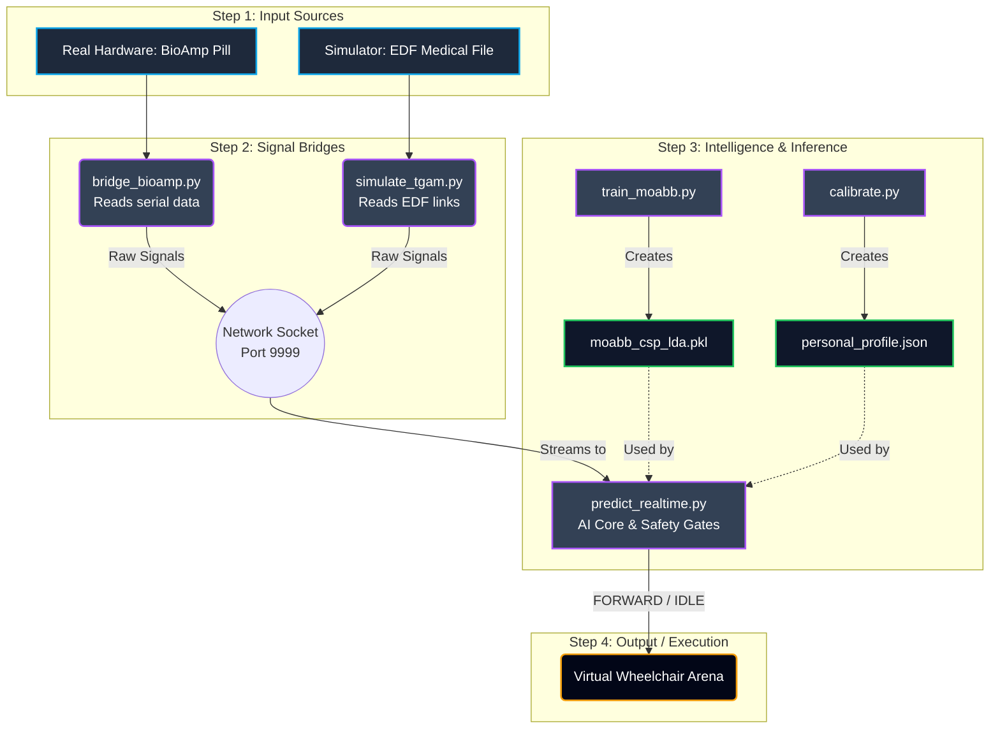

# ORBIT AI — Visual Workflow & Step-by-Step Simulation

This document maps how data moves through the codebase and provides a straightforward guide to running a simulation.

## 🗺️ Visual Architecture

## 🧠 System Breakdown (Simplified)

1. **Input:** You either connect the actual **BioAmp hardware** or run the **Simulator** using a medical dataset link.
2. **Network Bridge:** This data is forwarded locally to Port 9999 so the AI can listen to it.
3. **Intelligence Setup:** `train_moabb.py` builds the core AI brain, and `calibrate.py` tunes it to your resting state.
4. **The Live Core:** `predict_realtime.py` listens to Port 9999, checks for signal noise/fatigue (safety gates), and asks the AI for a decision.
5. **Execution:** The final command (e.g., `FORWARD`) moves the virtual wheelchair in the dashboard.

