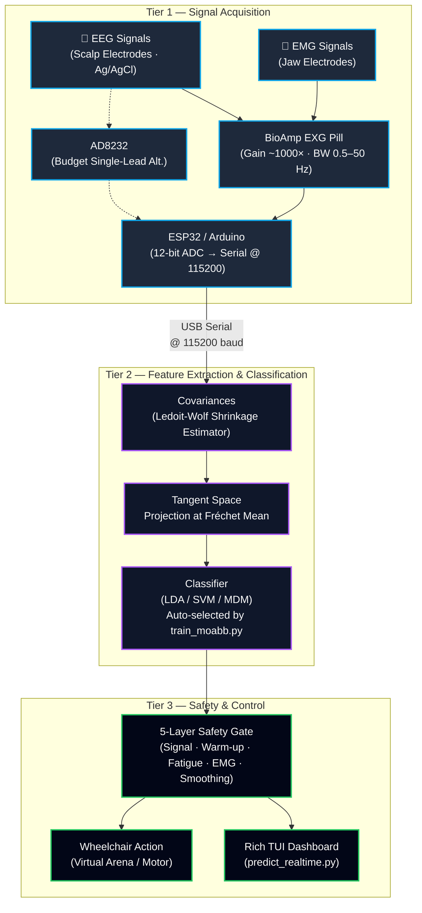
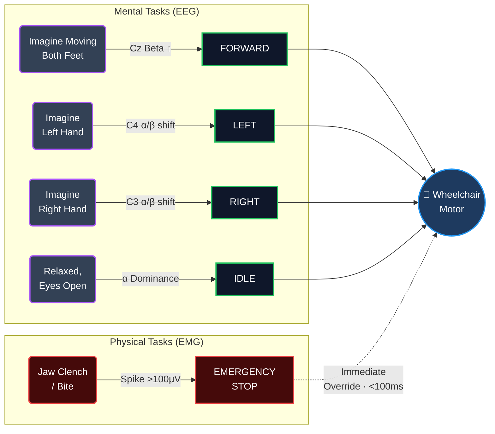
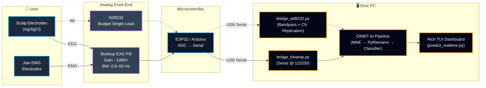
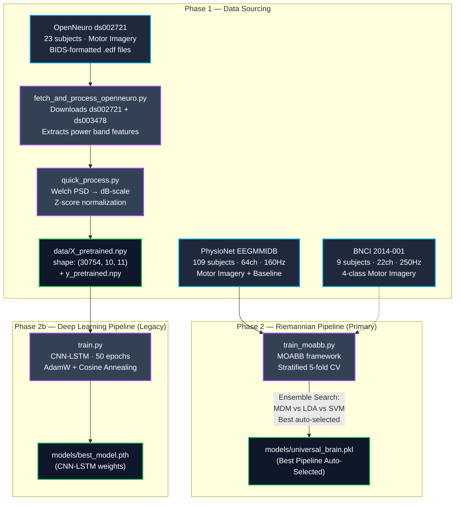
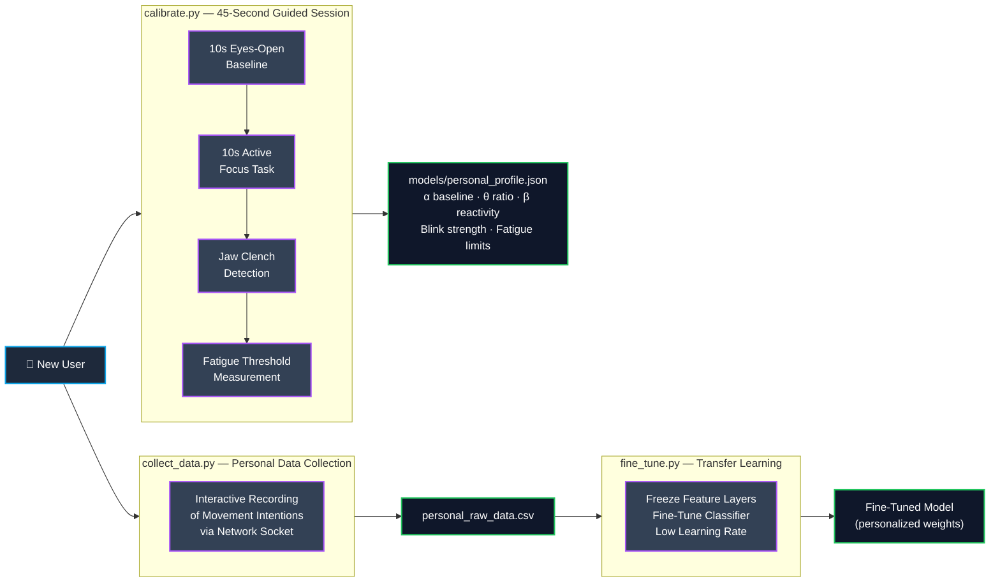
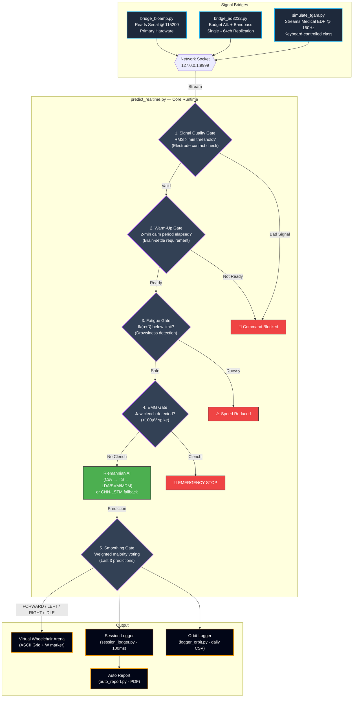
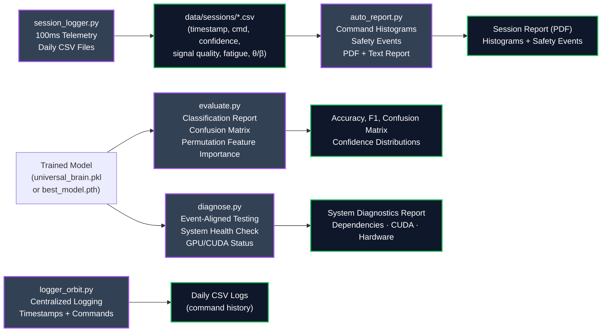

# ORBIT AI — Visual Workflow & System Architecture

This document maps how data flows through the entire ORBIT AI codebase — from raw EEG/EMG signals to real-time wheelchair control. It covers offline training, personal calibration, live inference, the 5-layer safety pipeline, and diagnostics. Each diagram annotates the specific scripts and artifacts involved.

---

## 🗺️ 1. Three-Tier System Architecture



---

## 🔀 2. Hybrid EEG + EMG Command Mapping

ORBIT AI uses a **"Safety-First" dual-modality** strategy: mental tasks decoded from EEG drive directional commands, while jaw-clench EMG provides a high-speed emergency override channel.



| Command | Signal | Mental / Physical Task | Bio-Marker | Latency |
|---------|--------|------------------------|------------|---------|
| **FORWARD** | 🧠 EEG | Imagine moving both feet | Cz Central Beta Power ↑ | ~1s window |
| **LEFT** | 🧠 EEG | Imagine squeezing left hand | C4 Alpha/Beta shift | ~1s window |
| **RIGHT** | 🧠 EEG | Imagine squeezing right hand | C3 Alpha/Beta shift | ~1s window |
| **IDLE** | 🧠 EEG | Relaxed state, eyes open | Alpha power dominance | ~1s window |
| **STOP** | 💪 EMG | **Jaw clench (bite teeth)** | High-frequency spike >100μV | **< 100ms** |

---

## 🔧 3. Hardware Connection Path



---

## 🔄 4. Full Data Pipeline — Offline Training



---

## 🎯 5. Calibration & Personalization



---

## ⚡ 6. Real-Time Inference Pipeline



---

## 📊 7. Diagnostics & Evaluation



---

## 📂 8. Complete Project File Map

### Signal Bridges & Simulators

| File | Role | Details |
|------|------|---------|
| `simulate_tgam.py` | Simulator Interface | Streams clinical EEG recordings from `X_pretrained.npy` over socket `127.0.0.1:9999`. Keyboard-controlled class selection (0=IDLE, 1=FORWARD). |
| `bridge_bioamp.py` | Primary Hardware Bridge | Reads raw EEG/EXG from BioAmp EXG Pill via USB serial. Applies 45Hz filter. Broadcasts over socket. |
| `bridge_ad8232.py` | Budget Hardware Bridge | Reads from AD8232 via Arduino. Applies custom bandpass filter. Replicates single input to 64-channel matrix. |

### Data Sourcing & Preprocessing

| File | Role | Details |
|------|------|---------|
| `fetch_and_process_openneuro.py` | Dataset Downloader | Downloads OpenNeuro ds002721 & ds003478. Extracts power band features from Fp1 electrode. |
| `preprocess.py` | Offline Data Pipeline | Loads raw CSV, removes outliers, computes ratio features, sliding windows, robust scaling, data augmentation. |
| `quick_process.py` | Fast Feature Extractor | Welch PSD analysis in dB-scale. Z-score normalization. Outputs sliding windows of shape `(N, 10, 11)`. |

### Brain Engine & Learning

| File | Role | Details |
|------|------|---------|
| `model.py` | Neural Network Definitions | Bidirectional LSTM with Self-Attention + CNN-LSTM hybrid (Conv1D→BiLSTM→FC). |
| `train.py` | Deep Learning Trainer (Legacy) | Binary IDLE/FORWARD training. 50 epochs, AdamW, cosine annealing. |
| `train_moabb.py` | ML Trainer (Primary) | MOABB framework. PhysioNet + BNCI datasets. Auto-selects best pipeline (MDM vs LDA vs SVM). |
| `fine_tune.py` | Transfer Learning | Freezes feature layers, fine-tunes classifier on personal data at low LR. |
| `calibrate.py` | Personal Profiler | 45-second guided session measuring α baseline, θ ratio, β reactivity, blink strength. |
| `collect_data.py` | Data Collector | Interactive recording of movement intentions from live socket stream. |

### Diagnostics, Logging & Reporting

| File | Role | Details |
|------|------|---------|
| `evaluate.py` | Model Evaluator | Classification reports, confusion matrices, confidence distributions, permutation importance. |
| `diagnose.py` | System Diagnostics | Event-aligned offline testing. Reports GPU/CUDA status, dependencies, hardware health. |
| `logger_orbit.py` | Centralized Logger | Records timestamps, commands, confidence, signal quality to daily CSV files. |
| `session_logger.py` | High-Freq Session Logger | 100ms telemetry (command, confidence, signal quality, fatigue, attention, meditation, θ/β). Auto-prints session summary. |
| `auto_report.py` | Report Generator | Post-session PDF/text reports with command histograms and safety event summaries. |

### Real-Time Execution

| File | Role | Details |
|------|------|---------|
| `predict_realtime.py` | Core Runtime + TUI | Listens to streaming bridge, applies 5 safety gates, runs inference, renders virtual wheelchair arena. |

### Configuration & Documentation

| File | Role | Details |
|------|------|---------|
| `config.py` | Master Configuration | COM ports, directories, sample rates, window sizes, safety limits, confidence thresholds, command maps. |
| `requirements.txt` | Dependencies | `torch`, `numpy`, `pandas`, `scikit-learn`, `matplotlib`, `seaborn`, `pyserial`, `joblib`, `tqdm`, `rich`, `mne`, `openneuro-py`. |
| `README.md` | Project README | High-level overview, setup guide, and user manual. |
| `ARCHITECTURE.md` | Architecture Deep-Dive | Technical algorithms, features, models, and multi-tier safety layers. |
| `orbit_ai_architecture.md` | Full Architecture Manual | Setup workflows, model layers, configuration guides. |
| `RND_PAPER.md` | R&D Paper | Research paper with datasets, references, algorithms, and results. |
| `FILE_ROLES.md` | File Roles Reference | Comprehensive mapping of each script to its role in the system. |
| `visual_workflow.md` | This Document | Mermaid flowcharts tracking all data pipelines and system architecture. |

---

## 🧠 9. Simplified System Breakdown

| Step | What Happens | Key Scripts | Key Artifacts |
|------|-------------|-------------|---------------|
| **1. Data Sourcing** | Download clinical EEG datasets from PhysioNet & OpenNeuro | `fetch_and_process_openneuro.py`, `quick_process.py` | `X_pretrained.npy`, `y_pretrained.npy` |
| **2. Training** | Build the "Universal Brain" — auto-selects best pipeline via ensemble search | `train_moabb.py` (primary), `train.py` (legacy CNN-LSTM) | `universal_brain.pkl`, `best_model.pth` |
| **3. Calibration** | 45-second personal profiling + optional data collection & fine-tuning | `calibrate.py`, `collect_data.py`, `fine_tune.py` | `personal_profile.json` |
| **4. Signal Bridge** | Connect hardware (BioAmp / AD8232) or run simulator → stream to Port 9999 | `bridge_bioamp.py`, `bridge_ad8232.py`, `simulate_tgam.py` | TCP socket stream |
| **5. Live Inference** | 5-layer safety gate → Riemannian AI → weighted voting → wheelchair command | `predict_realtime.py` | TUI dashboard + wheelchair arena |
| **6. Diagnostics** | Evaluate accuracy, log sessions, generate post-session reports | `evaluate.py`, `diagnose.py`, `session_logger.py`, `logger_orbit.py`, `auto_report.py` | Reports, CSVs, PDFs, confusion matrices |

---

## 🔄 10. Two Operating Modes

### Simulation Mode (Testing & Demos)
```
simulate_tgam.py  →(socket 9999)→  predict_realtime.py --demo
      ↑
 (Keyboard: 0=IDLE, 1=FORWARD)
```
Uses real clinical EEG patterns from PhysioNet — scientifically valid demo without hardware.

### Real Hardware Mode (Live Control)
```
Your Brain → BioAmp EXG Pill → ESP32 → USB Serial → bridge_bioamp.py →(socket 9999)→ predict_realtime.py
```

### Budget Hardware Mode (AD8232)
```
Your Brain → AD8232 → Arduino → USB Serial → bridge_ad8232.py →(socket 9999)→ predict_realtime.py
```

Switch modes by changing `SERIAL_PORT` in `config.py` and removing `--demo`.

---

## 🛡️ 11. Safety Gate Reference

| Gate | Check | Action on Failure | Latency |
|------|-------|--------------------|---------| 
| **1. Signal Quality** | RMS amplitude > electrode-contact threshold | Command blocked | Instant |
| **2. Warm-Up** | 2-minute brain-settle period elapsed | Command blocked | N/A (timer) |
| **3. Fatigue** | θ/(α+β) ratio below drowsiness limit | Speed reduced / alert issued | Continuous monitoring |
| **4. EMG Stop** | Jaw-clench spike > 100μV | Immediate wheelchair halt | **< 100ms** |
| **5. Smoothing** | Weighted majority voting over last 3 predictions | Prevents jitter / flickering | Per-prediction |

---

## 📈 12. Results Summary

| Metric | Value | Condition |
|--------|-------|-----------|
| **Validation Accuracy** | 87%+ | IDLE vs. FORWARD, PhysioNet 5-subject subset |
| **Cross-Validation** | 5-Fold Stratified | Best pipeline auto-selected |
| **Inference Latency** | < 100ms | Socket receive → prediction → display |
| **EMG Stop Latency** | < 100ms | Jaw-clench to STOP command |
| **Calibration Time** | 45 seconds | Personal profiling session |
| **Warm-up Required** | 2 minutes | Brain-settle period before movement |

---

*Updated: June 2026 | ORBIT AI v2.0 — Hybrid BCI-EMG System | NAVEENKCG/Mind_Wave_AImodel*
