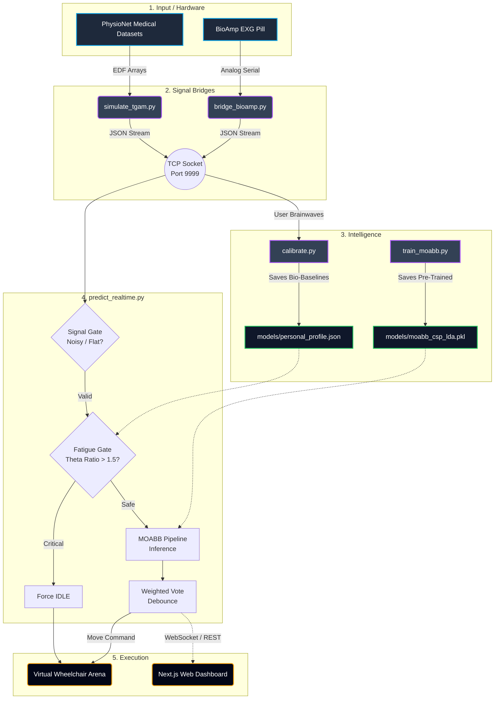

# ORBIT AI — Visual Workflow Architecture

This flowchart visually maps how data moves through the codebase, from your real-world hardware into the mathematical core of the AI, and lastly into the Virtual Arena.

## System Breakdown

1. **Input:** Data comes from either real-world hardware (`bioamp`) or a software simulator (`tgam`).
2. **Network Bridge:** This data is converted to JSON and fired continuously via a local networking socket (so multiple scripts can read it simultaneously).
3. **Intelligence Setup:** The heavy math takes place here. `train_moabb` creates the general AI brain, while `calibrate.py` creates a "profile" of your normal resting states.
4. **The Live Core:** `predict_realtime.py` acts as the security guard. It ensures the signal is good, ensures you aren't falling asleep, asks the AI for a decision, and smooths the result.
5. **Execution:** The final command moves the virtual machine!
