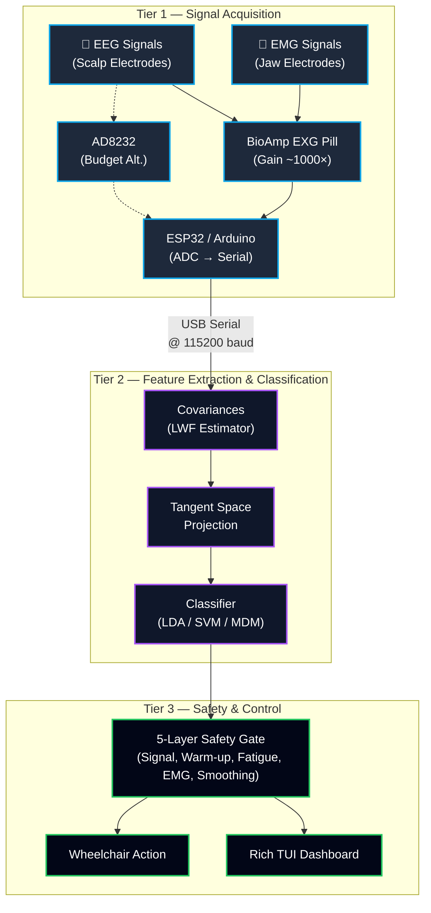
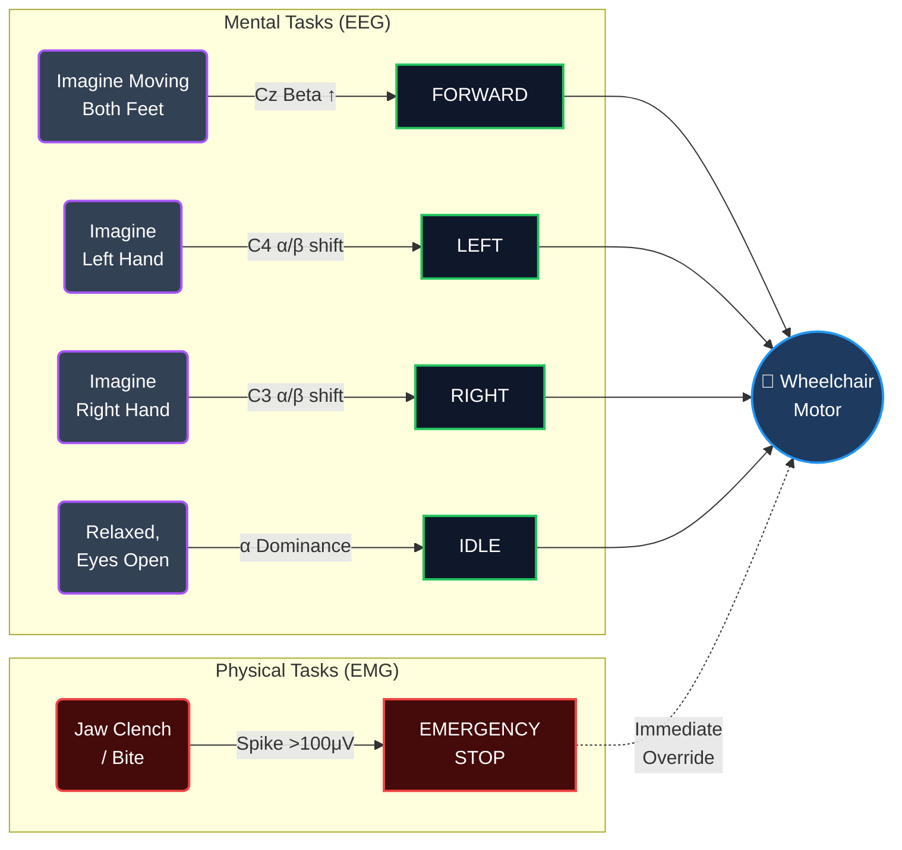
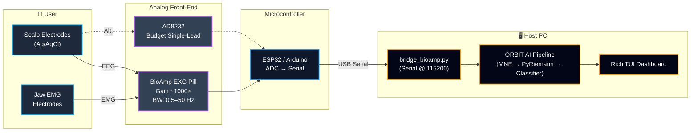
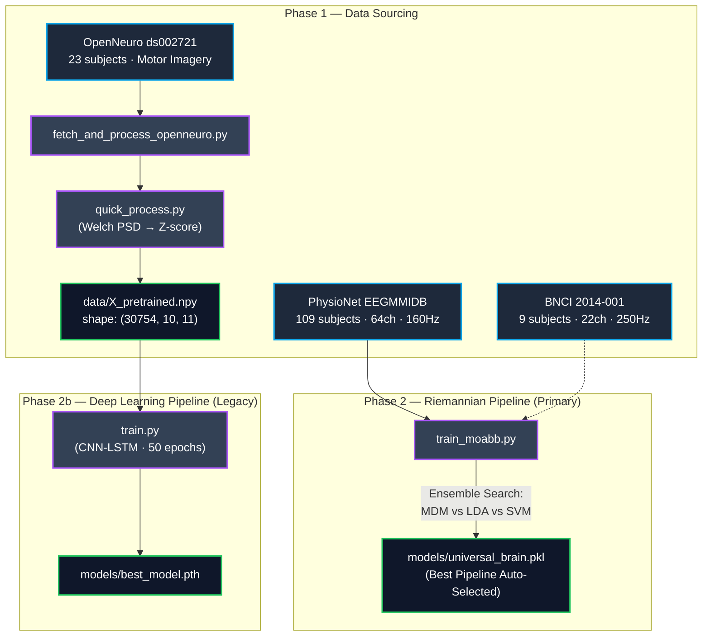
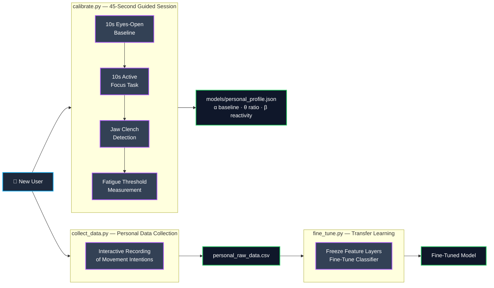
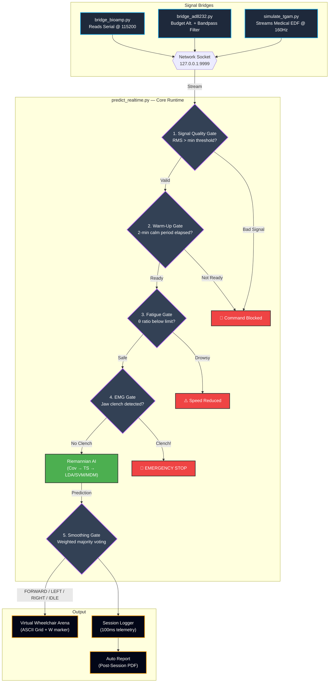
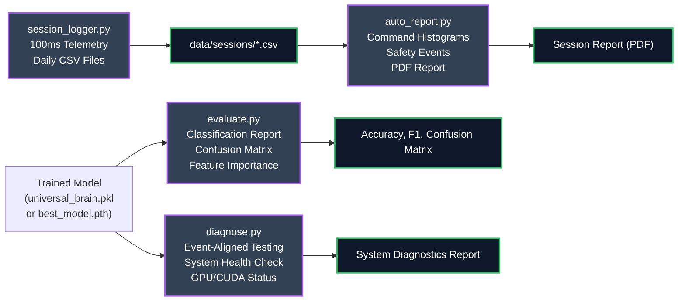

# ORBIT AI — Visual Workflow & System Architecture

This document maps how data flows through the entire ORBIT AI codebase — from raw EEG/EMG signals to real-time wheelchair control. It covers offline training, personal calibration, live inference, and the 5-layer safety pipeline.

---

## 🗺️ 1. Three-Tier System Architecture



---

## 🔀 2. Hybrid EEG + EMG Command Mapping



---

## 🔧 3. Hardware Connection Path



---

## 🔄 4. Full Data Pipeline — Offline Training



---

## 🎯 5. Calibration & Personalization



---

## ⚡ 6. Real-Time Inference Pipeline



---

## 📊 7. Diagnostics & Evaluation



---

## 🧠 8. Simplified System Breakdown

| Step | What Happens | Key Scripts | Key Artifacts |
|------|-------------|-------------|---------------|
| **1. Data Sourcing** | Download clinical EEG datasets from PhysioNet & OpenNeuro | `fetch_and_process_openneuro.py`, `quick_process.py` | `X_pretrained.npy`, `y_pretrained.npy` |
| **2. Training** | Build the "Universal Brain" — auto-selects best pipeline via ensemble search | `train_moabb.py` (primary), `train.py` (legacy CNN-LSTM) | `universal_brain.pkl`, `best_model.pth` |
| **3. Calibration** | 45-second personal profiling + optional data collection & fine-tuning | `calibrate.py`, `collect_data.py`, `fine_tune.py` | `personal_profile.json` |
| **4. Signal Bridge** | Connect hardware (BioAmp / AD8232) or run simulator → stream to Port 9999 | `bridge_bioamp.py`, `bridge_ad8232.py`, `simulate_tgam.py` | TCP socket stream |
| **5. Live Inference** | 5-layer safety gate → Riemannian AI → weighted voting → wheelchair command | `predict_realtime.py` | TUI dashboard + wheelchair arena |
| **6. Diagnostics** | Evaluate accuracy, log sessions, generate post-session reports | `evaluate.py`, `diagnose.py`, `session_logger.py`, `auto_report.py` | Reports, CSVs, confusion matrices |

---

## 🔄 9. Two Operating Modes

### Simulation Mode (Testing & Demos)
```
simulate_tgam.py  →(socket 9999)→  predict_realtime.py --demo
      ↑
 (Keyboard: 0=IDLE, 1=FORWARD)
```

### Real Hardware Mode (Live Control)
```
Your Brain → BioAmp EXG Pill → ESP32 → USB Serial → bridge_bioamp.py →(socket 9999)→ predict_realtime.py
```

Switch modes by changing `SERIAL_PORT` in `config.py` and removing `--demo`.

---

## 🛡️ 10. Safety Gate Reference

| Gate | Check | Action on Failure |
|------|-------|--------------------|
| **1. Signal Quality** | RMS amplitude > electrode-contact threshold | Command blocked |
| **2. Warm-Up** | 2-minute brain-settle period elapsed | Command blocked |
| **3. Fatigue** | θ/(α+β) ratio below drowsiness limit | Speed reduced / alert |
| **4. EMG Stop** | Jaw-clench spike > 100μV | Immediate wheelchair halt |
| **5. Smoothing** | Weighted majority voting over recent predictions | Prevents jitter / flickering |

---

*Updated: June 2026 | ORBIT AI v2.0 — Hybrid BCI-EMG System | NAVEENKCG/Mind_Wave_AImodel*
